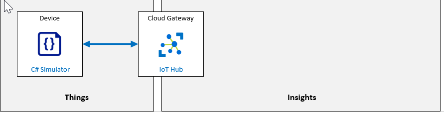

---
lab:
    title: 'Lab 04: Connect an IoT Device to Azure'
    module: 'Module 2: Devices and Device Communication'
---

# Connect an IoT Device to Azure

## Lab Scenario

Contoso is known for producing high quality cheeses. Due to the company's rapid growth in both popularity and sales, they want to take steps to ensure that their cheeses stay at the same high level of quality that their customers expect.

In the past, temperature and humidity data was collected by factory floor workers during each work shift. The company is concerned that the factory expansions will require increased monitoring as the new facilities come online and that a manual process for collecting data won't scale.

Contoso has decided to launch an automated system that uses IoT devices to monitor temperature and humidity. The rate at which telemetry data is communicated will be adjustable to help ensure that their manufacturing process is under control as batches of cheese proceed through environmentally sensitive processes.

To evaluate this asset monitoring solution prior to full scale implementation, you will be connecting an IoT device (that includes temperature and humidity sensors) to IoT Hub. For the purposes of this lab, you will be simulating an actual IoT device by using a .NET Core Console application.

The following resources will be created:



## In This Lab

In this lab, you will complete the following activities:

* Verify that the lab prerequisites are met (that you have the required Azure resources)
* Register a Device ID in Azure IoT Hub using Azure CLI
* Configure a simulated IoT device (pre-built and written in C#) to connect to Azure IoT Hub
* Run the simulated device in order to send Device-to-Cloud telemetry messages to the Azure IoT Hub
* Verify that device telemetry is being received by Azure IoT Hub by using Azure CLI

## Lab Instructions

### Exercise 1: Verify Lab Prerequisites

This lab assumes that the following Azure resources are available:

| Resource Type  | Resource Name                |
| :------------- | :--------------------------- |
| Resource Group | rg-az220                     |
| IoT Hub        | iot-az220-training-{your-id} |

If these resources are not available, you will need to run the **lab04-setup.azcli** script as instructed below before moving on to Exercise 2. The script file is included in the GitHub repository that you cloned locally as part of the dev environment configuration (lab 3).

> **Note**:  The **lab04-setup.azcli** script is written to run in a **bash** shell environment - the easiest way to execute this is in the Azure Cloud Shell.

1. Using a browser, open the [Azure Cloud Shell](https://shell.azure.com/) and login with the Azure subscription you are using for this course.

1. If you are prompted about setting up storage for Cloud Shell, accept the defaults.

1. Verify that the Azure Shell is using **Bash**.

    The dropdown in the top-left corner of the Azure Cloud Shell page is used to select the environment. Verify that the selected dropdown value is **Bash**.

1. On the Azure Shell toolbar, click **Upload/Download files** (fourth button from the right).

1. In the dropdown, click **Upload**.

1. In the file selection dialog, navigate to the folder location of the GitHub lab files that you downloaded when you configured your development environment.

    In Lab 3 of this course, "Setup the Development Environment", you cloned the GitHub repository containing lab resources by downloading a ZIP file and extracting the contents locally. The extracted folder structure includes the following folder path:

    * Allfiles
      * Labs
          * 04-Connect an IoT Device to Azure
            * Setup

    The lab04-setup.azcli script file is located in the Setup folder for lab 4.

1. Select the **lab04-setup.azcli** file, and then click **Open**.

    A notification will appear when the file upload has completed.

1. To verify that the correct file has uploaded, enter the following command:

    ```bash
    ls
    ```

    The `ls` command lists the content of the current directory. You should see the lab04-setup.azcli file listed.

1. To create a directory for this lab that contains the setup script and then move into that directory, enter the following Bash commands:

    ```bash
    mkdir lab4
    mv lab04-setup.azcli lab4
    cd lab4
    ```

    These commands will create a directory for this lab, move the **lab04-setup.azcli** file into that directory, and then change directory to make the new directory the current working directory.

1. To ensure the **lab04-setup.azcli** has the execute permission, enter the following command:

    ```bash
    chmod +x lab04-setup.azcli
    ```

1. On the Cloud Shell toolbar, to edit the **lab04-setup.azcli** file, click **Open Editor** (second button from the right - **{ }**).

1. In the **Files** list, to expand the lab4 folder, click **lab4**, and then click **lab04-setup.azcli**.

    The editor will now show the contents of the **lab04-setup.azcli** file.

1. In the editor, update the values of the `{your-id}` and `{your-location}` variables.

    Referencing the sample below as an example, you need to set `{your-id}` to the Unique ID you created at the start of this course - i.e. **cah191211**, and set `{your-location}` to the location that matches your resource group.

    ```bash
    #!/bin/bash

    RGName="rg-az220"
    IoTHubName="iot-az220-training-{your-id}"

    Location="{your-location}"
    ```

    > **Note**:  The `{your-location}` variable should be set to the short name for the region where you are deploying all of your resources. You can see a list of the available locations and their short-names (the **Name** column) by entering this command:
    >
    > ```bash
    > az account list-locations -o Table
    >
    > DisplayName           Latitude    Longitude    Name
    > --------------------  ----------  -----------  ------------------
    > East Asia             22.267      114.188      eastasia
    > Southeast Asia        1.283       103.833      southeastasia
    > Central US            41.5908     -93.6208     centralus
    > East US               37.3719     -79.8164     eastus
    > East US 2             36.6681     -78.3889     eastus2
    > ```

1. In the top-right of the editor window, to save the changes made to the file and close the editor, click **...**, and then click **Close Editor**.

    If prompted to save, click **Save** and the editor will close.

    > **Note**:  You can use **CTRL+S** to save at any time and **CTRL+Q** to close the editor.

1. To create the resources required for this lab, enter the following command:

    ```bash
    ./lab04-setup.azcli
    ```

    This will take a few minutes to run. You will see JSON output as each step completes.

Once the script has completed, you will be ready to continue with the lab.

### Exercise 2: Create an Azure IoT Hub Device ID using Azure Portal

IoT Hub's capabilities help you build scalable, full-featured IoT solutions such as managing industrial equipment used in manufacturing, tracking valuable assets in healthcare, monitoring office building usage, and many more scenarios. IoT Hub monitoring helps you maintain the health of your solution by tracking events such as device creation, device failures, and device connections. In this exercise we will use the Device Explorer to create a device and add it to the device registry.

#### Task 1: Create the Device

1. If necessary, log in to [portal.azure.com](https://portal.azure.com) using your Azure account credentials.

    If you have more than one Azure account, be sure that you are logged in with the account that is tied to the subscription that you will be using for this course.

1. Verify that your AZ-220 dashboard is being displayed.

1. On the rg-az220 resource group tile, click **iot-az220-training-{your-id}**

    When you first open your IoT Hub, it will display the _Overview_ blade. As you can see, the area at the top of this blade provides some essential information about your IoT Hub service, such as datacenter location and subscription. But this blade also includes tiles that provide information about how you are using your hub and recent activities. Let's take a look at these tiles before exploring further.

1. On the left side navigation menu, under **Explorers**, click **IoT devices**.

1. At the top of the **IoT devices** pane, click **+ New**.

1. In the **Device ID** field, enter **sensor-th-0001**

1. Under **Authentication type**, ensure **Symmetric key** is selected.

    Notice that there are three types of authentication available. In this lab we will leverage the simplest of the three, Symmetric key. X509 Certificates and their use for authentication will be covered in later labs.

1. Notice that the **Primary key** and **Secondary key** fields are disabled.

1. Under **Auto-generate keys**, ensure the checkbox is selected.

    With **Auto-generate keys** selected, the **Primary key** and **Secondary key** fields are disabled and will be populated once the record is saved. Un-selecting **Auto-generate keys** will enable those fields, allowing values to be directly entered.

1. Under **Connect this device to an IoT hub**, ensure **Enable** is selected.

    You might choose to disable this option during initial creation if you were creating the device entry ahead of rollout and you may update this value in the future if you wished to retain the device record, but prevent the associated device from connecting to the IoT Hub.

1. Under **Parent device**, leave **No parent device** as the value.

    IoT devices may be parented by other devices such as IoT Edge devices. This feature will be demonstrated in a later lab.

1. To add this device record to the IoT Hub, click **Save**.

    After a few moments, the **IoT devices** pane will refresh and the new device will be listed.

#### Task 2: Get the Device Connection String

In order for a device to connect to an IoT Hub, it needs to establish a connection. In this lab, we will use a connection string to connect directly to the IoT Hub. When using Symmetric key authentication, there are two connection strings available - one that utilizes the Primary key, the other that uses the Secondary key. As noted above, the Primary and Secondary keys are only generated once the device record is saved. Therefore, to obtain one of the connection strings, we must first save the record (see the above task) and then re-open the device record.

1. In the list of devices, click **sensor-th-0001**.

1. Notice that the device detail blade provides access to a number of device related functions as well the device properties. These functions will be explored in later labs.

1. Notice that the keys values and connection strings are populated, although obfuscated - click the **eye** icon on the right of each field to toggle showing and hiding the values.

1. To copy the **Primary Connection String** to the clipboard, click the **Copy** icon to the right of the field.

    Make note of the **Primary Connection String** (perhaps by pasting the value into a text editor such as NotePad). You will need to save this for use later.

    The connection string will be in the following format:

    ```text
    HostName={IoTHubName}.azure-devices.net;DeviceId=sensor-th-0001;SharedAccessKey={SharedAccessKey}
    ```

### Exercise 3: Create and Test a Simulated Device (C#)

In this exercise you will create a simulated device written in C# to connect to Azure IoT Hub using the Device ID and Shared Access Key created in the previous exercise. You will then test the device and ensure that IoT Hub is receiving telemetry from the device as expected.

#### Task 1: Create the initial project

1. Open a command prompt and navigate to the location where you wish to create the simulated device application.

1. At the command prompt, to create a directory named "CaveDevice" and change the current directory to that directory, enter the following commands:

   ```bash
   mkdir CaveDevice
   cd CaveDevice
   ```

1. To create a new .NET console application. enter the following command:

    ```bash
    dotnet new console
    ```

    This command creates a **Program.cs** file in your folder, along with a project file.

1. To install the code libraries required for your device app, enter the following commands:

    ```bash
    dotnet add package Microsoft.Azure.Devices.Client
    dotnet add package Newtonsoft.Json
    ```

    > **Note**: The **Microsoft.Azure.Devices.Client** package contains the Azure IoT Device SDK for .NET and the **Newtonsoft.Json** package contains APIs that aid in the creation and manipulation of JSON.

    You will build and test your simulated device app in the next task.

1. To ensure all of the application dependencies are downloaded, enter the following command

    ```bash
    dotnet restore
    ```

1. Open **Visual Studio Code**.

1. On the **File** menu, click **Open Folder**.

1. In the **Open Folder** dialog, navigate to the location where you created the **CaveDevice** directory.

1. In the list of folders, select **CaveDevice** and click **Select Folder**.

    The Explorer pane of Visual Studio Code should now list two C# project files:

    * CaveDevice.csproj
    * Program.cs

    > **Note**: If you see a message **Required assets to build and debug are missing from `CaveDevice`. Add them?**, you may click **Yes** to proceed.

#### Task 2: Explore the application

As noted above, the application currently consists of two files:

* CaveDevice.csproj
* Program.cs

In this task, we will briefly explore each file to gain an understanding of the purpose of each.

1. In Visual Studio Code Explorer pane, to open the application project file, click **CaveDevice.csproj**.

1. The **CaveDevice.csproj** file will open in the editor and should be similar to this:

    ```xml
    <Project Sdk="Microsoft.NET.Sdk">

        <PropertyGroup>
            <OutputType>Exe</OutputType>
            <TargetFramework>netcoreapp3.1</TargetFramework>
        </PropertyGroup>

        <ItemGroup>
            <PackageReference Include="Microsoft.Azure.Devices.Client" Version="1.25.0" />
            <PackageReference Include="Newtonsoft.Json" Version="12.0.3" />
        </ItemGroup>

    </Project>
    ```

    > **Note**: The package version numbers may differ from that show above.

    The project file is an XML document that specifies the type of project. In this instance, the project is an **Sdk** style project.

    The project definition contains two sections - a **PropertyGroup** and an **ItemGroup**.

    The **PropertyGroup** defines the type of output that building this project will produce - in this case an executable that targets .NET Core 3.1.

    The **ItemGroup** specifies any external libraries that are required for the application. These are particular references are NuGet packages and each package reference specifies the package name and the version. The `dotnet add package` commands we used earlier added these references to the project file and the `dotnet restore` command ensured all the dependencies were downloaded.

    > **Information**: You can learn more about NuGet [here](https://docs.microsoft.com/en-us/nuget/what-is-nuget).

1. In Visual Studio Code Explorer pane, to open the application project file, click **Program.cs**.

1. The **Program.cs** file will open in the editor and should be similar to this:

    ```csharp
    using System;

    namespace CaveSensor
    {
        class Program
        {
            static void Main(string[] args)
            {
                Console.WriteLine("Hello World!");
            }
        }
    }
    ```

    This very short program simply writes "Hello World!" to the command line. The key parts to this file are the following:

    * The `using` area - typically the top of the source file lists the namespaces the code is **using**. Here, the code specifies that it is `using System;`. This means that when we are entering code that is contained within the **System** namespace, we can omit **System** from the code. To make sense of that, it helps to know that the `Console` class we are using to write a line is within the **System** namespace - without specifying `using System;` we would have to write the console line as:

        ```csharp
        System.Console.WriteLine("Hello World!");
        ```

    * The `namespace` area - this specifies that the classes contained with the `{ }` that follows the namespace are part of that namespace. So, similar how **Console** is part of the **System** namespace, in the example above, the **Program** class is part of the **CaveSensor** namespace and its full name is **CaveSensor.Program**.

    * The `class` area - this defines the contents of the **Program** class. You may have more than one class within a single source file

    > **Note**: It is more typical that you separate the classes into a single class per source file, especially in larger projects. However, in these labs, we have chosen to have multiple classes per file in order to simplify the navigation instructions.

1. To compile and run the application, on the Visual Studio Code **View** menu, click **Terminal**.

    This will open the integrated Terminal at the bottom of the Visual Studio Code window.

1. At the Terminal command prompt, ensure that the current directory path is set to the `CaveDevice` folder.

1. To build and run the **CaveDevice** project, enter the following command:

    ```cmd/sh
    dotnet run
    ```

    After a moment, you should see the following:

    ```text
    ❯ dotnet run
    Hello World!
    ```

Although impressive, this is clearly not a simulated device. In the next task you will replace this code with the device code.

#### Task 3: Implement the simulated device code

In this task you will add code that leverages the Azure IoT Device SDK to connect to you IoT Hub resource.

1. In Visual Studio Code Explorer pane, to open the application project file, click **Program.cs**.

1. Select all of the existing code and delete it!

1. To create the basic structure of our simulated device, paste the following code into the editor:

    ```csharp
    // INSERT using statements below here

    namespace CaveDevice
    {
        class Program
        {
            // INSERT variables below here

            // INSERT Main method below here

            // INSERT SendDeviceToCloudMessagesAsync method below here

            // INSERT CreateMessageString method below here
        }

        // INSERT EnvironmentSensor class below here
    }
    ```

    >**Note:** As you can see, we have retained the namespace and the class, however, the other items are placeholder comments. In the following steps you will be asked to insert code into the file below specific comments. If at any point you get lost, you may refer to the lab **Final** project. This is referring to the lab resources files that you downloaded when setting up your development environment in lab 3. The folder path is:
    >
    > * Allfiles
    >   * Labs
    >      * LAB_AK_04-connect-iot-device-to-azure
    >        * Final

1. To specify the namespaces that the application code will be using, enter the following code beneath the `// INSERT using statements below here` comment:

    ```csharp
    using System;
    using System.Text;
    using System.Threading.Tasks;
    using Microsoft.Azure.Devices.Client;
    using Newtonsoft.Json;
    ```

    Notice that as well as specifying **System**, we are also declaring other namespaces that the code is using, such as **System.Text** for encoding strings, **System.Threading.Tasks** as we are using asynchronous tasks, and the namespaces for the two packages we added earlier.

    >**Tip**: When inserting code, the code layout may not be ideal. We can ask Visual Studio Code to format the document for us, by opening the **Task** pane (press **F1**) and typing **Format Document**, and then pressing **Enter**. On Windows, the shortcut for this task is **SHIFT+ALT+F**.

1. To specify the variables that the program is using, enter the following code beneath the `// INSERT variables below here` comment:

    ```csharp
    // Contains methods that a device can use to send messages to and receive from an IoT Hub.
    private static DeviceClient deviceClient;

    // The device connection string to authenticate the device with your IoT hub.
    // Note: in real-world applications you would not "hard-code" the connection string
    // It could be stored within an environment variable, passed in via the command-line or
    // store securely within a TPM module.
    private readonly static string connectionString = "{Your device connection string here}";
    ```

    Notice that the code includes comments describing the purpose of the variables.

    The **deviceClient** variable is used to store an instance of **DeviceClient** - this class comes from the Azure IoT Device SDK and contains methods that a device can use to send messages to and receive from an IoT Hub.

    The **connectionString** variable will contain the connection string for the device we created earlier. This value is used by the **DeviceClient** to connect to the IoT Hub.

    >**Important**: You will see examples in this and other labs throughout this course where connection strings, passwords and other configuration information is hard-coded into the application. This is done solely to simplify the labs and **is not** a recommended practice. As noted in the comments within the code, connection strings and similar configuration values should be supplied via alternative means such as environment variables, command-line parameters or, better still, stored in secured hardware such as Trusted Platform Modules (TPM).

1. Update the value of the **connectionString** variable with the device connection string you copied from the Azure Portal earlier. Once updated, the **connectionString** variable line should be similar to:

    ```csharp
    private readonly static string connectionString = "HostName=iot-az220-training-dm200420.azure-devices.net;DeviceId=sensor-th-0001;SharedAccessKey=hfavUmFgoCPA9feWjyfTx23SUHr+dqG9X193ctdEd90=";
    ```

1. To add the implementation of the **Main** method, insert the following code beneath the `// INSERT Main method below here` comment:

    ```csharp
    private static void Main(string[] args)
    {
        Console.WriteLine("IoT Hub C# Simulated Cave Device. Ctrl-C to exit.\n");

        // Connect to the IoT hub using the MQTT protocol
        deviceClient = DeviceClient.CreateFromConnectionString(connectionString, TransportType.Mqtt);
        SendDeviceToCloudMessagesAsync();
        Console.ReadLine();
    }
    ```

    The **Main** method is the first part of your application that is run once your app is started.

    Here we can see the basic structure of a simple device app is as follows:

    * Connect to the IoT Hub
    * Send telemetry to the app (Device to Cloud messages)

    You can see that the **deviceClient** variable is initialized with the result of the **DeviceClient** static method, **CreateFromConnectionString**. This method uses the connection string you specified earlier, as well as selecting the protocol that the device will use to the send telemetry -  in this case MQTT.

    >**Information**: The **DeviceClient** class is documented [here](https://docs.microsoft.com/en-us/dotnet/api/microsoft.azure.devices.client.deviceclient?view=azure-dotnet) and the **CreateFromConnectionString** method we use is documented [here](https://docs.microsoft.com/en-us/dotnet/api/microsoft.azure.devices.client.deviceclient.createfromconnectionstring?view=azure-dotnet#Microsoft_Azure_Devices_Client_DeviceClient_CreateFromConnectionString_System_String_Microsoft_Azure_Devices_Client_TransportType_).
    
    > **Note**: In a real-world application, the **CreateFromConnectionString** method call would be wrapped in exception handling code to gracefully deal with any connection issues. This and other lab code is kept as simple as possible to highlight the key points, so most error-handling is omitted for brevity.

    > **Information**: You can learn more about the supported transport protocols [here](https://docs.microsoft.com/en-us/azure/iot-hub/iot-hub-devguide-protocols).

    Once connected, the **SendDeviceToCloudMessagesAsync** method is called. You may notice that the method name is underlined with "red squiggles" - this is because Visual Studio Code has noticed that **SendDeviceToCloudMessagesAsync** is not yet implemented. We will add the method shortly.

    Finally, the application waits for user input.

1. To add the **SendDeviceToCloudMessagesAsync** method, insert the following code beneath the `// INSERT - SendDeviceToCloudMessagesAsync below here` comment:

    ```csharp
    private static async void SendDeviceToCloudMessagesAsync()
    {
        // Create an instance of our sensor
        var sensor = new EnvironmentSensor();

        while (true)
        {
            // read data from the sensor
            var currentTemperature = sensor.ReadTemperature();
            var currentHumidity = sensor.ReadHumidity();

            var messageString = CreateMessageString(currentTemperature, currentHumidity);

            // create a byte array from the message string using ASCII encoding
            var message = new Message(Encoding.ASCII.GetBytes(messageString));

            // Add a custom application property to the message.
            // An IoT hub can filter on these properties without access to the message body.
            message.Properties.Add("temperatureAlert", (currentTemperature > 30) ? "true" : "false");

            // Send the telemetry message
            await deviceClient.SendEventAsync(message);
            Console.WriteLine("{0} > Sending message: {1}", DateTime.Now, messageString);

            await Task.Delay(1000);
        }
    }
    ```

    Notice that the declaration for the **SendDeviceToCloudMessagesAsync** method includes the keyword `async`. This specifies that the methods contains asynchronous code that uses the `await` keyword and instructs the compiler to handle the callback plumbing for us.

    > **Information**: You can learn more about `async`, `await` and asynchronous programming in C# [here](https://docs.microsoft.com/en-us/dotnet/csharp/async).

    This method implements a typical message loop:

    * Read from one or more sensors
    * Create a message to send
    * Send the message
    * Wait for some time, or for an event to occur, etc.
    * Repeat the loop

    In this method, we create an instance of the **EnvironmentSensor** - we will add that class shortly.

    We then start an infinite loop - `while(true) {}` will repeat until the user hits **CTRL+C**.

    We then read the temperature and humidity from our sensor and use those values to create a message string - we will add **CreateMessageString** in a moment.

    We then create the actual **message** by creating an instance of the **Message** class from the Azure IoT Device SDK - the data structure that represents the message that is used for interacting with IotHub. The constructor we use for the **Message** class requires that the message string be encoded as a byte array.

    > **Information**: The **Message** class is documented [here](https://docs.microsoft.com/en-us/dotnet/api/microsoft.azure.devices.client.message?view=azure-dotnet)

    Next we show that the message can be augmented with additional properties - here, for example, we set the **temperatureAlert** property to true if the **currentTemperature** is greater than 30, otherwise false.

    We then send the telemetry via the `await deviceClient.SendEventAsync(message);` call. Note that the lines contains an `await` keyword. This instructs the compiler that the following code is asynchronous and will complete some time in the future - when it does complete, this method will continue executing on the next line.

    Finally, we write out message showing the sent telemetry and then wait for 1000 milliseconds (1 second) before repeating the loop.

1. To add the **CreateMessageString** method that creates a JSON string from the sensor readings, insert the following code beneath the `// INSERT CreateMessageString method below here` comment:

    ```csharp
    private static string CreateMessageString(double temperature, double humidity)
    {
        // Create an anonymous object that matches the data structure we wish to send
        var telemetryDataPoint = new
        {
            temperature = temperature,
            humidity = humidity
        };

        // Create a JSON string from the anonymous object
        return JsonConvert.SerializeObject(telemetryDataPoint);
    }
    ```

    This method creates an anonymous object with the temperature and humidity properties and assignes it to **telemetryDataPoint**.

    The value of **telemetryDataPoint** is then converted to a JSON string via the **JsonConvert** class that is part of the **Newtonsoft.Json** package you added earlier. The JSON string value is then returned to be used as the payload in the message.

1. The final missing piece of the puzzle is the **EnvironmentSensor** class. To add this, insert the code beneath the `// INSERT EnvironmentSensor class below here` comment:

    ```csharp
    // INSERT EnvironmentSensor class below here
    /// <summary>
    /// This class represents a sensor 
    /// real-world sensors would contain code to initialize
    /// the device or devices and maintain internal state
    /// a real-world example can be found here: https://bit.ly/IoT-BME280
    /// </summary>
    internal class EnvironmentSensor
    {
        // Initial telemetry values
        double minTemperature = 20;
        double minHumidity = 60;
        Random rand = new Random();

        internal EnvironmentSensor()
        {
            // device initialization could occur here
        }

        internal double ReadTemperature()
        {
            return minTemperature + rand.NextDouble() * 15;
        }

        internal double ReadHumidity()
        {
            return minHumidity + rand.NextDouble() * 20;
        }
    }
    ```

    This is a very simple class that uses random numbers to return values that represent temperature and humidity. In reality,it is often much more complex to interact with sensors, especially if you have to communicate at a low-level with them.

    > **Information**: You can view a more representative example of the code that interacts with a simple temperature, humidity and pressure sensor [here](https://bit.ly/IoT-BME280).

1. Review the code that you have entered. This represents a very simple simulated device and how to connect the device to an IoT Hub and send Device to Cloud messages.

You are now ready to test the application

#### Task 4: Test the application

1. In Visual Studio Code Explorer pane, on the **View** menu, click **Terminal**.

    Verify that the selected terminal shell is the windows command prompt.

1. In the Terminal view, at the command prompt, enter the following command:

    ```cmd/sh
    dotnet run
    ```

    This command will build and run the Simulated Device application. Be sure the terminal location is set to the directory with the `CaveDevice.cs` file.

    > **Note**:  If the command outputs a `Malformed Token` or other error message, then make sure the **Device Connection String** is configured correctly as the value of the `connectionString` variable.

1. Once the Simulated Device application is running, it will be sending event messages to the Azure IoT Hub that include `temperature` and `humidity` values.

    The terminal output will look similar to the following:

    ```text
    IoT Hub C# Simulated Cave Device. Ctrl-C to exit.

    10/25/2019 6:10:12 PM > Sending message: {"temperature":27.714212817472504,"humidity":63.88147743599558}
    10/25/2019 6:10:13 PM > Sending message: {"temperature":20.017463779085066,"humidity":64.53511070671263}
    10/25/2019 6:10:14 PM > Sending message: {"temperature":20.723927165718717,"humidity":74.07808918230147}
    10/25/2019 6:10:15 PM > Sending message: {"temperature":20.48506045736608,"humidity":71.47250854944461}
    10/25/2019 6:10:16 PM > Sending message: {"temperature":25.027703996760632,"humidity":69.21247714628115}
    10/25/2019 6:10:17 PM > Sending message: {"temperature":29.867399432634656,"humidity":78.19206098010395}
    10/25/2019 6:10:18 PM > Sending message: {"temperature":33.29597232085465,"humidity":62.8990878830194}
    10/25/2019 6:10:19 PM > Sending message: {"temperature":25.77350195766124,"humidity":67.27347029711747}
    ```

    > **Note**: Leave the simulated device app running for now. Your next task will be to verify that your IoT Hub is receiving the telemetry messages.

#### Task 3: Verify Telemetry Stream sent to Azure IoT Hub

In this task, you will use the Azure CLI to verify telemetry sent by the simulated device is being received by Azure IoT Hub.

1. Using a browser, open the [Azure Cloud Shell](https://shell.azure.com/) and login with the Azure subscription you are using for this course.

1. In the Azure Cloud Shell, enter the following command:

    ```cmd/sh
    az iot hub monitor-events --hub-name {IoTHubName} --device-id sensor-th-0001
    ```

    _Be sure to replace the **{IoTHubName}** placeholder with the name of your Azure IoT Hub._

    > **Note**:  If you receive a message stating _"Dependency update required for IoT extension version"_ when running the Azure CLI command, then press `y` to accept the update and press `Enter`. This will allow the command to continue as expected.

    The `--device-id` parameter is optional and allows you to monitor the events from a single device. If the parameters is omitted, the command will monitor all events sent to the specified Azure IoT Hub.

    The `monitor-events` command within the `az iot hub` Azure CLI module offers the capability to monitor device telemetry & messages sent to an Azure IoT Hub from within the command-line / terminal.

1. Notice that the `az iot hub monitor-events` Azure CLI command outputs a JSON representation of the events that are arriving at your specified Azure IoT Hub. 

    This command enables you to monitor the events being sent to IoT hub. You are also verifying that the device is able to connect to and communicate with the your IoT hub.

    You should see messages displayed that are similar to the following:

    ```cmd/sh
    Starting event monitor, filtering on device: sensor-th-0001, use ctrl-c to stop...
    {
        "event": {
            "origin": "sensor-th-0001",
            "payload": "{\"temperature\":25.058683971901743,\"humidity\":67.54816981383979}"
        }
    }
    {
        "event": {
            "origin": "sensor-th-0001",
            "payload": "{\"temperature\":29.202181296051563,\"humidity\":69.13840303623043}"
        }
    }
    ```

1. Once you have verified that IoT hub is receiving the telemetry, press **Ctrl-C** in the Azure Cloud Shell and Visual Studio Code windows.

    Ctrl-C is used to stop the running apps. Always remember to shut down unneeded apps and jobs.
