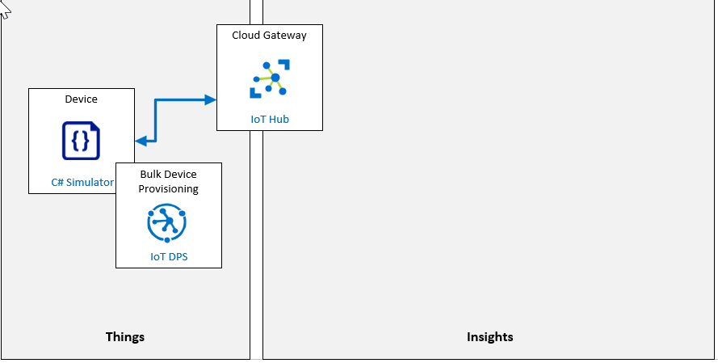

---
lab:
    title: 'Lab 05: Individual Enrollment of a Device in DPS'
    module: 'Module 3: Device Provisioning at Scale'
---

# Individual Enrollment of a Device in DPS

## Lab Scenario

Contoso management is pushing for an an update to their Asset Monitoring and Tracking Solution that will use IoT devices to reduce the manual data entry work that is required under the current system and provide more advanced monitoring during the shipping process. The solution relies on the ability to provision and de-provision IoT devices. The best option for managing the provisioning requirements appears to be DSP.

The proposed system will use IoT devices with integrated sensors for tracking the location, temperature, pressure of shipping containers during transit. The devices will be placed within the existing shipping containers that Contoso uses to transport their cheese, and will connect to Azure IoT Hub using vehicle provided WiFi. The new system will provide continuous monitoring of the product environment and enable a variety of notification scenarios when issues are detected.

In Contoso's cheese packaging facility, when an empty container enters the system it will be equipped with the new IoT device and then loaded with packaged cheese products. The IoT device needs to be auto-provisioned to IoT hub using Device Provisioning Service. When the container arrives at the destination, the IoT device will be retrieved and then "decommissioned" through DPS. The device will be re-used for future shipments.

You have been tasked with validating the device provisioning and de-provisioning process using DPS. For the initial phase of the process you will use an Individual Enrollment approach.

The following resources will be created:



## In This Lab

In this lab, you will complete the following activities:

* Verify that the lab prerequisites are met (that you have the required Azure resources)
* Create a new Individual Enrollment in DPS
* Configure a Simulated Device
* Test the Simulated Device
* Retire the Device

## Lab Instructions

### Exercise 1: Verify Lab Prerequisites

This lab assumes that the following Azure resources are available:

| Resource Type | Resource Name |
| :-- | :-- |
| Resource Group | AZ-220-RG |
| IoT Hub | AZ-220-HUB-*{YOUR-ID}* |
| Device Provisioning Service | AZ-220-DPS-*{YOUR-ID}* |

If these resources are not available, you will need to run the **lab05-setup.azcli** script as instructed below before moving on to Exercise 2. The script file is included in the GitHub repository that you cloned locally as part of the dev environment configuration (lab 3).

The **lab05-setup.azcli** script is written to run in a **bash** shell environment - the easiest way to execute this is in the Azure Cloud Shell.

1. Using a browser, open the [Azure Cloud Shell](https://shell.azure.com/) and login with the Azure subscription you are using for this course.

    If you are prompted about setting up storage for Cloud Shell, accept the defaults.

1. Verify that the Azure Cloud Shell is using **Bash**.

    The dropdown in the top-left corner of the Azure Cloud Shell page is used to select the environment. Verify that the selected dropdown value is **Bash**.

1. On the Azure Shell toolbar, click **Upload/Download files** (fourth button from the right).

1. In the dropdown, click **Upload**.

1. In the file selection dialog, navigate to the folder location of the GitHub lab files that you downloaded when you configured your development environment.

    In _Lab 3: Setup the Development Environment_, you cloned the GitHub repository containing lab resources by downloading a ZIP file and extracting the contents locally. The extracted folder structure includes the following folder path:

    * Allfiles
      * Labs
          * 05-Individual Enrollment of a Device in DPS
            * Setup

    The lab05-setup.azcli script file is located in the Setup folder for lab 5.

1. Select the **lab05-setup.azcli** file, and then click **Open**.

    A notification will appear when the file upload has completed.

1. To verify that the correct file has uploaded, enter the following command:

    ```bash
    ls
    ```

    The `ls` command lists the content of the current directory. You should see the lab05-setup.azcli file listed.

1. To create a directory for this lab that contains the setup script and then move into that directory, enter the following Bash commands:

    ```bash
    mkdir lab5
    mv lab05-setup.azcli lab4
    cd lab5
    ```

    These commands will create a directory for this lab, move the **lab05-setup.azcli** file into that directory, and then change directory to make the new directory the current working directory.

1. To ensure the **lab05-setup.azcli** script has the execute permission, enter the following command:

    ```bash
    chmod +x lab05-setup.azcli
    ```

1. On the Cloud Shell toolbar, to edit the lab06-setup.azcli file, click **Open Editor** (second button from the right - **{ }**).

1. In the **Files** list, to expand the lab6 folder and open the script file, click **lab5**, and then click **lab05-setup.azcli**.

    The editor will now show the contents of the **lab05-setup.azcli** file.

1. In the editor, update the values of the `{YOUR-ID}` and `{YOUR-LOCATION}` variables.

    Referencing the sample below as an example, you need to set `{YOUR-ID}` to the Unique ID you created at the start of this course - i.e. **CAH191211**, and set `{YOUR-LOCATION}` to the location that makes sense for your resources.

    ```bash
    #!/bin/bash

    RGName="AZ-220-RG"
    IoTHubName="AZ-220-HUB-{YOUR-ID}"

    Location="{YOUR-LOCATION}"
    ```

    > **Note**:  The `{YOUR-LOCATION}` variable should be set to the short name for the region. You can see a list of the available regions and their short-names (the **Name** column) by entering this command:
    >
    > ```bash
    > az account list-locations -o Table
    >
    > DisplayName           Latitude    Longitude    Name
    > --------------------  ----------  -----------  ------------------
    > East Asia             22.267      114.188      eastasia
    > Southeast Asia        1.283       103.833      southeastasia
    > Central US            41.5908     -93.6208     centralus
    > East US               37.3719     -79.8164     eastus
    > East US 2             36.6681     -78.3889     eastus2
    > ```

1. In the top-right of the editor window, to save the changes made to the file and close the editor, click **...**, and then click **Close Editor**.

    If prompted to save, click **Save** and the editor will close.

    > **Note**:  You can use **CTRL+S** to save at any time and **CTRL+Q** to close the editor.

1. To create the resources required for this lab, enter the following command:

    ```bash
    ./lab05-setup.azcli
    ```

    This will take a few minutes to run. You will see JSON output as each step completes.

    Once the script has completed, you will be ready to continue with the lab.

### Exercise 2: Create new individual enrollment (Symmetric keys) in DPS

In this exercise, you will create a new individual enrollment for a device within the Device Provisioning Service (DPS) using _symmetric key attestation_.

#### Task 1: Create the enrollment

1. If necessary, log in to your Azure portal using your Azure account credentials.

    If you have more than one Azure account, be sure that you are logged in with the account that is tied to the subscription that you will be using for this course.

1. Notice that the **AZ-220** dashboard that you created in the previous task has been loaded.

    You should see both your IoT Hub and DPS resources listed.

1. On your Resource group tile, click **AZ-220-DPS-*{YOUR-ID}***.

1. On the Device Provisioning Service **Settings** pane on the left side, click **Manage enrollments**.

1. At the top of the pane, click **+ Add individual enrollment**.

1. On the **Add Enrollment** blade, in the **Mechanism** dropdown, click **Symmetric Key**.

    This sets the attestation method to use Symmetric key authentication.

1. Just below the Mechanism setting, notice that the **Auto-generate keys** option is checked.

    This sets DPS to automatically generate both the **Primary Key** and **Secondary Key** values for the device enrollment when it's created. Optionally, un-checking this option enables custom keys to be manually entered.

1. In the **Registration ID** field, to specify the Registration ID to use for the device enrollment within DPS, enter **DPSSimulatedDevice1**

    By default, the Registration ID will be used as the IoT Hub Device ID when the device is provisioned from the enrollment. If these values need to be different, then enter the required IoT Hub Device ID in that field.

1. Leave the **IoT Hub Device ID** field blank.

    Leaving this field blank ensures that the IoT Hub will use the Registration ID as the Device ID. Don't worry if you see a default text value in the field that is not selectable - this is placeholder text and will not be treated as an entered value.

1. Leave the **IoT Edge device** field set to **False**.

   The new device will not be an edge device. Working with IoT Edge devices will be discussed later in the course.

1. Leave the **Select how you want to assign devices to hubs** field set to **Evenly weighted distribution**.

   As you only have one IoT Hub associated with the enrollment, this setting is somewhat unimportant.  In larger environments where you have multiple distributed hubs, this setting will control how to choose what IoT Hub should receive this device enrollment. There are four supported allocation policies:

    * **Lowest latency**: Devices are provisioned to an IoT hub based on the hub with the lowest latency to the device.
    * **Evenly weighted distribution (default)**: Linked IoT hubs are equally likely to have devices provisioned to them. This is the default setting. If you are provisioning devices to only one IoT hub, you can keep this setting. 
    * **Static configuration via the enrollment list**: Specification of the desired IoT hub in the enrollment list takes priority over the Device Provisioning Service-level allocation policy.
    * **Custom (Use Azure Function)**: the device provisioning service calls your Azure Function code providing all relevant information about the device and the enrollment. Your function code is executed and returns the IoT hub information used to provisioning the device.

1. Notice that the **Select the IoT hubs this device can be assigned to** dropdown specifies the **AZ-220-HUB-*{YOUR-ID}*** IoT hub that you created.

   This field is used to specify the IoT Hub(s) that your _DPSSimulatedDevice1_ device can be assigned to.

1. Leave the **Select how you want device data to be handled on re-provisioning** field set to the default value of **Re-provision and migrate data**.

    This field gives you high-level control over the re-provisioning behavior, where the same device (as indicated through the same Registration ID) submits a later provisioning request after already being provisioned successfully at least once. There are three options available:

    * **Re-provision and migrate data**: This policy is the default for new enrollment entries. This policy takes action when devices associated with the enrollment entry submit a new provisioning request. Depending on the enrollment entry configuration, the device may be reassigned to another IoT hub. If the device is changing IoT hubs, the device registration with the initial IoT hub will be removed. All device state information from that initial IoT hub will be migrated over to the new IoT hub.
    * **Re-provision and reset to initial config**: This policy is often used for a factory reset without changing IoT hubs. This policy takes action when devices associated with the enrollment entry submit a new provisioning request. Depending on the enrollment entry configuration, the device may be reassigned to another IoT hub. If the device is changing IoT hubs, the device registration with the initial IoT hub will be removed. The initial configuration data that the provisioning service instance received when the device was provisioned is provided to the new IoT hub.
    * **Never reprovision**: The device is never reassigned to a different hub. This policy is provided for managing backwards compatibility.

1. In the **Initial Device Twin State** field, modify the `properties.desired` JSON object to specify a property named `telemetryDelay` with the value of `"2"`.

    The final JSON will be like the following:

    ```json
    {
        "tags": {},
        "properties": {
            "desired": {
                "telemetryDelay": "2"
            }
        }
    }
    ```

    This field contains JSON data that represents the initial configuration of desired properties for the device. The data that you entered will be used by the Device to set the time delay for reading sensor telemetry and sending events to IoT Hub.

1. Leave the **Enable entry** field set to **Enable**.

    Generally, you'll want to enable new enrollment entries and keep them enabled.

1. At the top of the **Add Enrollment** blade, click **Save**.

#### Task 2: Validate the enrollment

1. On the **Manage enrollments** blade, to view the list of individual device enrollments, click **individual enrollments**.

1. Under Individual Enrollments, click **DPSSimulatedDevice1**.

    This enables you to view the enrollment details for the individual enrollment that you just created.

1. Locate the **Authentication Type** section, and notice that **Mechanism** is set to **Symmetric Key**.

1. Copy the **Primary Key** and **Secondary Key** values for this device enrollment (there is a button to the right of each textbox for this purpose), and save them for reference later.

    These are the authentication keys for the device to authenticate with the service.

1. Locate the **Initial device twin State**, and notice the JSON for the device twin Desired State contains the `telemetryDelay` property set to the value of `"2"`.

1. Close the **DPSSimulatedDevice1** view to return to the **AZ-220-DPS-*{YOUR-ID}*** blade.

### Exercise 3: Configure Simulated Device

In this exercise, you will configure a Simulated Device written in C# to connect to Azure IoT using the individual enrollment created in the previous unit. You will also add code to the Simulated Device that will read and update device configuration based on the device twin within Azure IoT Hub.

The simulated device that you create in this exercise represents an IoT Device that will be located within a shipping container/box, and will be used to monitor Contoso products while they are in transit. The sensor telemetry from the device that will be sent to Azure IoT Hub includes Temperature, Humidity, Pressure, and Latitude/Longitude coordinates of the container. The device is part of the overall asset tracking solution.

This is different than the earlier lab where a simulated device connected to Azure because in that lab, you used a shared access key to authenticate, which does not require device provisioning, but also does not give the provisioning management benefits (such as device twins), and requires fairly large distribution and management of a shared key.  In this lab, you are provisioning a unique device through the Device Provisioning Service.

#### Task 1: Create the Simulated Device

1. On the **AZ-220-DPS-*{YOUR-ID}*** blade, navigate to the **Overview** pane.

1. In the top-right area of the blade, hover the mouse pointer over value assigned to ID Scope, and then click **Copy to clipboard**.

    You will be using this value shortly, so make note of the value if you are unable to use the clipboard. Be sure to differentiate between uppercase "O" and the number "0".

    The **ID Scope** will be similar to this value: `0ne0004E52G`

1. Using **Visual Studio Code**, open the Starter folder for Lab 5.

    Again, this is referring to the lab resources files that you downloaded when setting up your development environment in lab 3. The folder path is:

    * Allfiles
      * Labs
          * 05-Individual Enrollment of a Device in DPS
            * Starter

1. on the **View** menu, click **Terminal**.

    Verify that the selected terminal shell is the windows command prompt.

1. To restore all the application NuGet packages via the command-line, in the Terminal view, at the command prompt, enter the following command:

    ```cmd/sh
    dotnet restore
    ```

1. In the Visual Studio Code Explorer pane, click **Program.cs**.

1. In the code editor, near the top of the Program class, locate the `dpsIdScope` variable, and then update the assigned value using the ID Scope value that you copied from the Device Provisioning Service in the Azure portal.

    > **Note**: If you don't have the value of ID Scope available to you, you can find it on the Overview blade of the DPS service (in the Azure portal).

1. Locate the `registrationId` variable, and replace the value with **DPSSimulatedDevice1**

    This variable represents the **Registration ID** value for the individual enrollment that you created in the Device Provisioning Service.

1. Locate the `individualEnrollmentPrimaryKey` and `individualEnrollmentSecondaryKey` variables, and replace their values with the **Primary Key** and **Secondary Key** values that you saved when configuring the individual enrollment for the simulated device.

    > **Note**: If you don't have these Key values available, you can copy them from the Azure portal as follows -
    >
    > Open the **Manage enrollments** blade, click **Individual Enrollments**, click **DPSSimulatedDevice1**. Copy the values and then paste as noted above.

1. Review the source code for the simulated device, and take notice of the following items:

    * The `ProvisioningDeviceLogic` class contains the logic for reading from the simulated device sensors.
    * The `ProvisioningDeviceLogic.SendDeviceToCloudMessagesAsync` method contains the logic for generating the simulated sensor readings for Temperature, Humidity, Pressure, Latitude, and Longitude. This method also sends the telemetry as Device-to-Cloud messages to Azure IoT Hub.

1. At the bottom of the `ProvisioningDeviceLogic.SendDeviceToCloudMessagesAsync` method, notice the call to `Task.Delay`.

    `Task.Delay` is used to "pause" the `while` loop for a period of time before creating and sending the next telemetry message. The `_telemetryDelay` variable is used to define how many seconds to wait before sending the next telemetry message.

1. Near the top of the `ProvisioningDeviceLogic` class, locate the `_telemetryDelay` variable declaration.

    Notice that the default value for the delay is set to `1` second. Your next step is to integrate the code that uses a device twin value to control the delay time.

#### Task 2: Integrate Device Twin Properties

To use the device twin properties (from Azure IoT Hub) on a device, you need to create the code that accesses and applies the device twin properties. In this case, we want to update our simulated device code to read a device twin Desired Property, and then assign that value to the `_telemetryDelay` variable. We also want to update the device twin Reported Property to indicate the delay value that is currently implemented on our device.

1. In the Visual Studio Code editor, locate the `RunAsync` method.

1. Take a moment to review the code, and then find the `// TODO 1: Setup OnDesiredPropertyChanged Event Handling` comment.

    To begin the integration of device twin properties, we need code that enables the simulated device to be notified when a device twin property is updated.

    To achieve this, we can use the `DeviceClient.SetDesiredPropertyUpdateCallbackAsync` method, and set up an event handler by creating an `OnDesiredPropertyChanged` event.

1. To set up the DeviceClient for an OnDesiredPropertyChanged event, replace the `// TODO 1:` comment with the following code:

    ```csharp
    Console.WriteLine("Connecting SetDesiredPropertyUpdateCallbackAsync event handler...");
    await iotClient.SetDesiredPropertyUpdateCallbackAsync(OnDesiredPropertyChanged, null).ConfigureAwait(false);
    ```

    In case you are wondering, we created the `iotClient` instance of DeviceClient at the top of the ProvisioningDeviceLogic class.

    Next, we need to add our `OnDesiredPropertyChanged` method to the `ProvisioningDeviceLogic` class.

1. To complete the setup of the event handler, add the following method code to the ProvisioningDeviceLogic class:

    > **Note**: You can place this code below the `RunAsync` method (that way it will be near the other code that you're updating).

    ```csharp
    private async Task OnDesiredPropertyChanged(TwinCollection desiredProperties, object userContext)
    {
        Console.WriteLine("Desired Twin Property Changed:");
        Console.WriteLine($"{desiredProperties.ToJson()}");

        // Read the desired Twin Properties
        if (desiredProperties.Contains("telemetryDelay"))
        {
            string desiredTelemetryDelay = desiredProperties["telemetryDelay"];
            if (desiredTelemetryDelay != null)
            {
                this._telemetryDelay = int.Parse(desiredTelemetryDelay);
            }
            // if desired telemetryDelay is null or unspecified, don't change it
        }


        // Report Twin Properties
        var reportedProperties = new TwinCollection();
        reportedProperties["telemetryDelay"] = this._telemetryDelay.ToString();
        await iotClient.UpdateReportedPropertiesAsync(reportedProperties).ConfigureAwait(false);
        Console.WriteLine("Reported Twin Properties:");
        Console.WriteLine($"{reportedProperties.ToJson()}");
    }
    ```

    Notice that the `OnDesiredPropertyChanged` method includes the code to read the device twin Desired Properties, configures the `_telemetryDelay` variable, and then reports the Reported Properties back to the device twin to tell Azure IoT Hub what the current state of the simulated device is configured to.

1. In the `RunAsync` method, locate the `//TODO 2: Load device twin Properties` comment.

1. To read the device twin desired properties and configure the device to match on device startup, replace the `// TODO 2:` comment with the following code:

    ```csharp
    Console.WriteLine("Loading device twin Properties...");
    var twin = await iotClient.GetTwinAsync().ConfigureAwait(false);
    await OnDesiredPropertyChanged(twin.Properties.Desired, null);
    ```

    This code calls the `DeviceTwin.GetTwinAsync` method to retrieve the device twin for the simulated device. It then accesses the `Properties.Desired` property object to retrieve the current Desired State for the device, and passes that to the `OnDesiredPropertyChanged` method that will configure the simulated devices `_telemetryDelay` variable.

    Notice, this code reuses the `OnDesiredPropertyChanged` method that was already created for handling _OnDesiredPropertyChanged_ events. This helps keep the code that reads the device twin desired state properties and configures the device at startup in a single place. The resulting code is simpler and easier to maintain.

1. On the top menu of Visual Studio Code, click **File**, and then click **Save**.

    Your simulated device will now use the device twin properties from Azure IoT Hub to set the delay between telemetry messages.

### Exercise 4: Test the Simulated Device

In this exercise, you will run the Simulated Device and verify it's sending sensor telemetry to Azure IoT Hub. You will also update the delay at which telemetry is sent to Azure IoT Hub by updating the device twin for the simulated device within Azure IoT Hub.

#### Task 1: Build and run the device

1. Ensure that you have your code project open in Visual Studio Code.

1. On the top menu, click **View**, and then click **Terminal**.

1. In the Terminal pane, ensure the command prompt shows the directory path for the `Program.cs` file.

1. At the command prompt, to build and run the Simulated Device application, enter the following command:

    ```cmd/sh
    dotnet run
    ```

    > **Note**: When the Simulated Device application runs, it will first write some details about it's status to the console (terminal pane).

1. Notice that the JSON output following the `Desired Twin Property Changed:` line contains the desired value for the `telemetryDelay` for the device.

    You can scroll up in the terminal pane to review the output. It should be similar to the following:

    ```text
    RegistrationID = DPSSimulatedDevice1
    ProvisioningClient RegisterAsync . . . Device Registration Status: Assigned
    ProvisioningClient AssignedHub: AZ-220-HUB-CP1019.azure-devices.net; DeviceID: DPSSimulatedDevice1
    Creating Symmetric Key DeviceClient authentication
    Simulated Device. Ctrl-C to exit.
    DeviceClient OpenAsync.
    Connecting SetDesiredPropertyUpdateCallbackAsync event handler...
    Loading device twin Properties...
    Desired Twin Property Changed:
    {"telemetryDelay":"2","$version":1}
    Reported Twin Properties:
    {"telemetryDelay":2}
    Start reading and sending device telemetry...
    ```

1. Notice that the Simulated Device application begins sending telemetry events to the Azure IoT Hub.

    The telemetry events include values for `temperature`, `humidity`, `pressure`, `latitude`, and `longitude`, and should be similar to the following:

    ```text
    11/6/2019 6:38:55 PM > Sending message: {"temperature":25.59094770373355,"humidity":71.17629229611545,"pressure":1019.9274696347665,"latitude":39.82133964767944,"longitude":-98.18181981142438}
    11/6/2019 6:38:57 PM > Sending message: {"temperature":24.68789062681044,"humidity":71.52098010830628,"pressure":1022.6521258267584,"latitude":40.05846882452387,"longitude":-98.08765031156229}
    11/6/2019 6:38:59 PM > Sending message: {"temperature":28.087463226675737,"humidity":74.76071353757787,"pressure":1017.614206096327,"latitude":40.269273772972454,"longitude":-98.28354453319591}
    11/6/2019 6:39:01 PM > Sending message: {"temperature":23.575667940813894,"humidity":77.66409506912534,"pressure":1017.0118147748344,"latitude":40.21020096551372,"longitude":-98.48636739129239}
    ```

    Notice the timestamp differences between telemetry readings. The delay between telemetry messages should be `2` seconds as configured through the device twin; instead of the default of `1` second in the source code.

1. Leave the simulated device app running.

    You will verify that the device code is behaving as expected during the next activities.

#### Task 2: Verify Telemetry Stream sent to Azure IoT Hub

In this task, you will use the Azure CLI to verify telemetry sent by the simulated device is being received by Azure IoT Hub.

1. Using a browser, open the [Azure Cloud Shell](https://shell.azure.com/) and login with the Azure subscription you are using for this course.

1. In the Azure Cloud Shell, enter the following command:

    ```cmd/sh
    az iot hub monitor-events --hub-name {IoTHubName} --device-id DPSSimulatedDevice1
    ```

    _Be sure to replace the **{IoTHubName}** placeholder with the name of your Azure IoT Hub._

1. Notice that your IoT hub is receiving the telemetry messages from the DPSSimulatedDevice1 device.

    Continue to leave the simulated device application running for the next task.

#### Task 3: Change the device configuration through its twin

With the simulated device running, the `telemetryDelay` configuration can be updated by editing the device twin Desired State within Azure IoT Hub. This can be done by configuring the Device in the Azure IoT Hub within the Azure portal.

1. Open the **Azure Portal** (if it is not already open), and then navigate to your **Azure IoT Hub** service.

1. On the IoT Hub blade, on the left side of the blade, under the **Explorers** section, click **IoT devices**.

1. Within the list of IoT devices, click **DPSSimulatedDevice1**.

    > **IMPORTANT**: Make sure you select the device that you are using for this lab.

1. On the device blade, at the top of the blade, click **Device Twin**.

    The **Device twin** blade provides an editor with the full JSON for the device twin. This enables you to view and/or edit the device twin state directly within the Azure portal.

1. Locate the JSON for the `properties.desired` object.

    This contains the desired state for the device. Notice the `telemetryDelay` property already exists, and is set to `"2"`, as was configured when the device was provisioned based on the Individual Enrollment in DPS.

1. To update the value assigned to the `telemetryDelay` desired property, change the value to `"5"`

    The value includes the quotes ("").

1. At the top of the blade, click **Save**

    The `OnDesiredPropertyChanged` event will be triggered automatically within the code for the Simulated Device, and the device will update its configuration to reflect the changes to the device twin Desired state.

1. Switch to the Visual Studio Code window that you are using to run the simulated device application.

1. In Visual Studio Code, scroll to the bottom of the Terminal pane.

1. Notice that the device recognizes the change to the device twin properties.

    The output will show a message that the `Desired Twin Property Changed` along with the JSON for the new desired`telemetryDelay` property value. Once the device picks up the new configuration of device twin desired state, it will automatically update to start sending sensor telemetry every 5 seconds as now configured.

    ```text
    Desired Twin Property Changed:
    {"telemetryDelay":"5","$version":2}
    Reported Twin Properties:
    {"telemetryDelay":5}
    11/6/2019 7:29:55 PM > Sending message: {"temperature":33.01780830277959,"humidity":68.52464504936927,"pressure":1023.0929576073974,"latitude":39.97641877038439,"longitude":-98.49544472071804}
    11/6/2019 7:30:00 PM > Sending message: {"temperature":33.95490410689027,"humidity":71.57070464062072,"pressure":1013.3468084112261,"latitude":40.01604868659767,"longitude":-98.51051877869526}
    11/6/2019 7:30:05 PM > Sending message: {"temperature":22.055266337494956,"humidity":67.50505594886144,"pressure":1018.1765662249767,"latitude":40.22292566031555,"longitude":-98.4367936214764}
    ```

1. Switch to the browser page where you are running the Azure CLI command in the Azure Cloud Shell.

    Ensure that you are still running the `az iot hub monitor-events` command. If it isn't running, re-start the command.

1. Notice that the telemetry events sent to Azure IoT Hub being received at the new interval of 5 seconds.

1. Use **Ctrl-C** to stop both the `az` command and the Simulated Device application.

1. In the Azure Portal, close the **Device twin** blade.

1. Still in the Azure Portal, on the Simulated Device blade, click **Device Twin**.

1. This time, locate the JSON for the `properties.reported` object.

    This contains the state reported by the device. Notice the `telemetryDelay` property exists here as well, and is also set to `5`.  There is also a `$metadata` value that shows you when the value was reported data was last updated and when the specific reported value was last updated.

1. Again close the **Device twin** blade.

1. Close the simulated device blade, and then close the IoT Hub blade.

### Exercise 5: Retire the Device

In this unit you will perform the necessary tasks to retire the device from both the Device Provisioning Service (DPS) and Azure IoT Hub. To fully retire an IoT Device from an Azure IoT solution it must be removed from both of these services. When the transport box arrives at it's final destination, then sensor will be removed from the box, and needs to be "decommissioned". Complete device retirement is an important step in the life cycle of IoT devices within an IoT solution.

#### Task 1: Retire the device from the DPS

1. If necessary, log in to your Azure portal using your Azure account credentials.

    If you have more than one Azure account, be sure that you are logged in with the account that is tied to the subscription that you will be using for this course.

1. Notice that the **AZ-220** dashboard that you created in the previous task has been loaded.

    You should see both your IoT Hub and DPS resources listed.

1. On your Resource group tile, to navigate to your Device Provisioning Service, click **AZ-220-DPS-*{YOUR-ID}***.

1. On the Device Provisioning Service blade, on the left side menu, click **Manage enrollments**.

1. On the Manage enrollments blade, to view the list of individual device enrollments, click **Individual Enrollments**.

1. To select the DPSSimulatedDevice1 individual device enrollment, select the checkbox to the left of the name.

    Note that you don't want to open the device enrollment, you just want to select it.

1. At the top of the blade, click **Delete**.

    > **Note**: Deleting the individual enrollment from DPS will permanently remove the enrollment. To temporarily disable the enrollment, you can set the **Enable entry** setting to **Disable** within the **Enrollment Details** for the individual enrollment.

1. On the **Remove enrollment** prompt, click **Yes**.

    The individual enrollment is now removed from the Device Provisioning Service (DPS). To complete the device retirement, the **Device ID** for the Simulated Device also must be removed from the **Azure IoT Hub** service.

#### Task 2: Retire the device from the IoT Hub

1. In the Azure portal, navigate back to your Dashboard.

1. On your resource group tile, click **AZ-220-HUB-*{YOUR-ID}*** to navigate to the Azure IoT Hub.

1. On the IoT Hub blade, on the left side of the blade, under the **Explorers** section, click on **IoT devices**.

1. Within the list of IoT devices, select the checkbox to the left of the DPSSimulatedDevice1 Device ID.

    > **IMPORTANT**: Make sure you select the device representing the simulated device that you used for this lab.

1. At the top of the blade, click **Delete**.

1. On the **Are you certain you wish to delete selected device(s)** prompt, click **Yes**.

    > **Note**:  Deleting the device ID from IoT Hub will permanently remove the device registration. To temporarily disable the device from connecting to IoT Hub, you can set the **Enable connection to IoT Hub** to **Disable** within the properties for the device.

Now that the Device Enrollment has been removed from the Device Provisioning Service, and the matching Device ID has been removed from the Azure IoT Hub, the simulated device has been fully retired from the solution.
