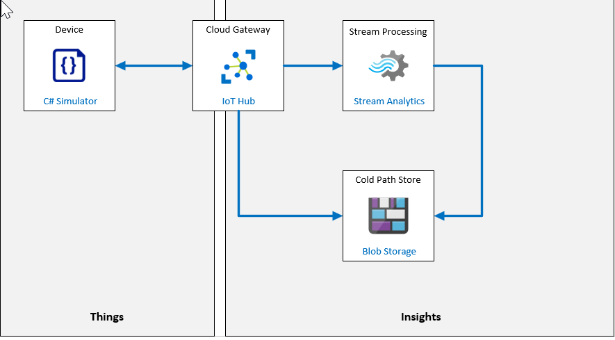

---
lab:
    title: 'Lab 07: Device Message Routing'
    module: 'Module 4: Message Processing and Analytics'
---

# Device Message Routing

## Lab Scenario

Contoso Management is impressed with your implementation of automatic device enrollment using DPS. They are now asking you to begin exploring an IoT solution for a business-specific issue associated with product packaging and shipping.

A key component of the Contoso cheese-making business is the packaging and shipping of cheese to customers. To maximize cost efficiency, Contoso operates an on-premises packaging facility. The workflow is straightforward - packages are assembled for shipping, then placed on a conveyor belt system that takes the packages and drops them off at mailing bins. The metric for success is the number of packages leaving the conveyor belt system during a given time period (typically a work shift).

The conveyor belt system is a critical link in this process, and is visually monitored to ensure that packages are delivered correctly. The system has three operator controlled speeds: stopped, slow, and fast. Naturally, the number of packages being delivered at the slow speed is less than at the faster speed. However, the vibration level of the conveyor belt system is also less at the slower speed. In addition, high vibration levels are know to accelerate wear-and-tear of the system and can cause packages to fall from the conveyor. If vibration becomes excessive, the conveyor belt must be stopped to allow for inspection so that more serious failures are avoided.

The primary goal for your solution will be to implement a form of preventive maintenance based on vibration levels, which can be used to detect that something is wrong before serious system damage occurs. 

> **Note**: **Preventive maintenance** (sometimes called preventative maintenance or predictive maintenance) is an equipment maintenance program that schedules maintenance activities to be performed while the equipment is operating normally. The intent of this approach is to avoid unexpected breakdowns that often incur costly disruptions.

It's not always easy to detect abnormal vibration levels. For this reason, you are looking into an Azure IoT solution that will help to measure vibration levels and data anomalies. Vibration sensors will be attached to the conveyor belt at various locations, and you will use IoT devices to send telemetry to an IoT hub. The IoT hub will use Azure Stream Analytics, and a built-in Machine Learning (ML) model, to alert you to vibration anomalies in real time. You also plan to archive all of the telemetry data so that it can be further analyzed in the future.

You decide to prototype the solution using simulated telemetry from a single IoT device.

To simulate the vibration data in a realistic manner, you work with one of the engineers to understand a little bit about what causes the vibrations. It turns out that there are a number of different types of vibration that contribute to the overall vibration level. For example, a "force vibration" could be introduced by a broken guide wheel or an especially heavy load placed improperly on the conveyor belt. There's also an "increasing vibration", that can be introduced when a system design limit (such as speed or weight) is exceeded. With a little help, you able to develop the code for a simulated IoT device that produces an acceptable representation of vibration data and will generate anomalies.

The following resources will be created:



## In This Lab

In this lab, you will complete the following activities:

* Verify that the lab prerequisites are met (that you have the required Azure resources)
* Create an Azure IoT Hub, and a device ID using Azure CLI
* Create a C# app to send device telemetry to the IoT Hub, using Visual Studio code
* Create a message route, through to blob storage, using the Azure portal
* Create a second message route, through to an Azure Stream Analytics job, using the Azure portal

## Lab Instructions

### Exercise 1: Verify Lab Prerequisites

This lab assumes the following Azure resources are available:

| Resource Type | Resource Name |
| :-- | :-- |
| Resource Group | AZ-220-RG |
| IoT Hub | AZ-220-HUB-*{YOUR-ID}* |
| Device ID | VibrationSensorId |

If these resources are not available, you will need to run the **lab07-setup.azcli** script as instructed below before moving on to Exercise 2. The script file is included in the GitHub repository that you cloned locally as part of the dev environment configuration (lab 3).

The **lab07-setup.azcli** script is written to run in a **bash** shell environment - the easiest way to execute this is in the Azure Cloud Shell.

1. Using a browser, open the [Azure Shell](https://shell.azure.com/) and login with the Azure subscription you are using for this course.

    If you are prompted about setting up storage for Cloud Shell, accept the defaults.

1. Verify that the Azure Cloud Shell is using **Bash**.

    The dropdown in the top-left corner of the Azure Cloud Shell page is used to select the environment. Verify that the selected dropdown value is **Bash**.

1. On the Azure Shell toolbar, click **Upload/Download files** (fourth button from the right).

1. In the dropdown, click **Upload**.

1. In the file selection dialog, navigate to the folder location of the GitHub lab files that you downloaded when you configured your development environment.

    In _Lab 3: Setup the Development Environment_, you cloned the GitHub repository containing lab resources by downloading a ZIP file and extracting the contents locally. The extracted folder structure includes the following folder path:

    * Allfiles
      * Labs
          * 07-Device Message Routing
            * Setup

    The lab07-setup.azcli script file is located in the Setup folder for lab 7.

1. Select the **lab07-setup.azcli** file, and then click **Open**.

    A notification will appear when the file upload has completed.

1. To verify that the correct file has uploaded in Azure Cloud Shell, enter the following command:

    ```bash
    ls
    ```

    The `ls` command lists the content of the current directory. You should see the lab07-setup.azcli file listed.

1. To create a directory for this lab that contains the setup script and then move into that directory, enter the following Bash commands:

    ```bash
    mkdir lab7
    mv lab07-setup.azcli lab7
    cd lab7
    ```

1. To ensure that **lab07-setup.azcli** has the execute permission, enter the following command:

    ```bash
    chmod +x lab07-setup.azcli
    ```

1. On the Cloud Shell toolbar, to edit the lab07-setup.azcli file, click **Open Editor** (second button from the right - **{ }**).

1. In the **FILES** list, to expand the lab7 folder and open the script file, click **lab7**, and then click **lab07-setup.azcli**.

    The editor will now show the contents of the **lab07-setup.azcli** file.

1. In the editor, update the `{YOUR-ID}` and `{YOUR-LOCATION}` assigned values.

    Referencing the sample below as an example, you need to set `{YOUR-ID}` to the Unique ID you created at the start of this course - i.e. **CAH191211**, and set `{YOUR-LOCATION}` to the location that makes sense for your resources.

    ```bash
    #!/bin/bash

    YourID="{YOUR-ID}"
    RGName="AZ-220-RG"
    IoTHubName="AZ-220-HUB-$YourID"

    Location="{YOUR-LOCATION}"
    ```

    > **Note**:  The `{YOUR-LOCATION}` variable should be set to the short name for the region. You can see a list of the available regions and their short-names (the **Name** column) by entering this command:
    >
    > ```bash
    > az account list-locations -o Table
    >
    > DisplayName           Latitude    Longitude    Name
    > --------------------  ----------  -----------  ------------------
    > East Asia             22.267      114.188      eastasia
    > Southeast Asia        1.283       103.833      southeastasia
    > Central US            41.5908     -93.6208     centralus
    > East US               37.3719     -79.8164     eastus
    > East US 2             36.6681     -78.3889     eastus2
    > ```

1. In the top-right of the editor window, to save the changes made to the file and close the editor, click **...**, and then click **Close Editor**.

    If prompted to save, click **Save** and the editor will close.

    > **Note**:  You can use **CTRL+S** to save at any time and **CTRL+Q** to close the editor.

1. To create the resources required for this lab, enter the following command:

    ```bash
    ./lab07-setup.azcli
    ```

    This script can take a few minutes to run. You will see JSON output as each step completes.

    The script will first create a resource group named **AZ-220-RG** and an IoT Hub named **AZ-220-HUB-{YourID}**. If they already exist, a corresponding message will be displayed. The script will then add a device with an ID of **VibrationSensorId** to the IoT hub and display the device connection string.

1. Notice that, once the script has completed, the connection string for the device is displayed.

    The connection string starts with "HostName="

1. Copy the connection string into a text document, and note that it is for the **VibrationSensorId** device.

    Once you have saved the connection string to a location where you can find it easily, you will be ready to continue with the lab.

### Exercise 2: Write Code for Vibration Telemetry

The key to monitoring our conveyor belt is the output of vibration telemetry. Vibration is usually measured as an acceleration (m/s&#x00B2;), although sometimes it's measured in g-forces, where 1 g = 9.81 m/s&#x00B2;. There are three types of vibration.

* Natural vibration, which is just the frequency a structure tends to oscillate.
* Free vibration, which occurs when the structure is impacted, but then left to oscillate without interference.
* Forced vibration, which occurs when the structure is under some stress.

Forced vibration is the dangerous one for our conveyor belt. Even if it starts at a low level this vibration can build so that the structure fails prematurely. There's less of a case for free vibration in conveyor belt operation. Most machines, as we all know, have a natural vibration.

The code sample that you will build simulates a conveyor belt running at a range of speeds (stopped, slow, fast). The faster the belt is running, the more packages are delivered, but the greater the effects of vibration. We'll add natural vibration, based on a sine wave with some randomization. It's possible our anomaly detection system will falsely identify a spike or dip in this sine wave as an anomaly. We'll then add two forms of forced vibration. The first has the effect of a cyclic increase in vibration (see the images below). And secondly, an increasing vibration, where an additional sine wave is added, starting small but growing.

During this prototype phase we assume that our conveyor belt has just one sensor device (our simulated IoT Device). In addition to communicating vibration data, the sensor also pumps out some other data (packages delivered, ambient temperature, and similar metrics). For this lab, the additional values will be sent to a storage archive.

Almost all the coding in this lab will be completed during this exercise. You will be using Visual Studio Code to build the simulator code in C#. You will complete a small amount of SQL coding later in the lab.

In this exercise, you will:

* build the conveyor belt simulator
* send telemetry messages to the IoT Hub created in the previous unit

#### Task 1: Create an App to Send Telemetry

1. Open Visual Studio Code, and then verify that the C# Extension is installed.

    You set up the development environment in lab 3 of this course, but it's worth quickly double-checking before you start building your device app. 

    To use C# in Visual Studio Code, both [.NET Core](https://dotnet.microsoft.com/download) and the [C# extension](https://marketplace.visualstudio.com/items?itemName=ms-vscode.csharp) must be installed. You can open the Visual Studio Code Extensions pane using the left-side toolbar by clicking the 5th button from the top.

1. On the **Terminal** menu, click **New Terminal**.

    Notice the directory path indicated as part of the command prompt. You do not want to start building this project within the folder structure of a previous lab project.
  
1. At the terminal command prompt, to create a directory named "vibrationdevice" and change the current directory to that directory, enter the following commands:

   ```bash
   mkdir vibrationdevice
   cd vibrationdevice
   ```

1. To create a new .NET console application. enter the following command:

    ```bash
    dotnet new console
    ```

    This command creates a **Program.cs** file in your folder, along with a project file.

1. To install the code libraries required for your device app, enter the following commands:

    ```bash
    dotnet add package Microsoft.Azure.Devices.Client
    dotnet add package Newtonsoft.Json
    ```

    You will build and test your simulated device app in the next task.

#### Task 2: Add Code to Send Telemetry

The simulated device app that you build in this task simulates an IoT device that is monitoring the conveyor belt. The app will simulate sensor readings and report vibration sensor data every two seconds.

1. On the Visual Studio Code **File** menu, click **Open Folder**.

    You will use the folder path listed within the Terminal command prompt to locate your project folder.
  
1. In the Open Folder dialog, navigate to the directory path displayed within the Terminal command prompt, click **vibrationdevice**, and then click **Select Folder**.

    If you are prompted to load required assetts, click **Yes**.

    The Visual Studio Code EXPLORER pane should now be open. If it is not, use the left-side toolbar to open the EXPLORER pane. You can hover your mouse pointer over the toolbar buttons to display the button names.

1. In the EXPLORER pane, click **Program.cs**.

1. In the code editor view, delete the default contents of the Program.cs file.

    The default contents were created when you ran the `dotnet new console` command in the previous task.

1. To create the code for your simulated device, paste the following code into the empty Program.cs file:

    ```csharp
    // Copyright (c) Microsoft. All rights reserved.
    // Licensed under the MIT license. See LICENSE file in the project root for full license information.

    using System;
    using Microsoft.Azure.Devices.Client;
    using Newtonsoft.Json;
    using System.Text;
    using System.Threading.Tasks;

    namespace vibration_device
    {
        class SimulatedDevice
        {
            // Telemetry globals.
            private const int intervalInMilliseconds = 2000;                                // Time interval required by wait function.
            private static readonly int intervalInSeconds = intervalInMilliseconds / 1000;  // Time interval in seconds.

            // Conveyor belt globals.
            enum SpeedEnum
            {
                stopped,
                slow,
                fast
            }
            private static int packageCount = 0;                                        // Count of packages leaving the conveyor belt.
            private static SpeedEnum beltSpeed = SpeedEnum.stopped;                     // Initial state of the conveyor belt.
            private static readonly double slowPackagesPerSecond = 1;                   // Packages completed at slow speed/ per second
            private static readonly double fastPackagesPerSecond = 2;                   // Packages completed at fast speed/ per second
            private static double beltStoppedSeconds = 0;                               // Time the belt has been stopped.
            private static double temperature = 60;                                     // Ambient temperature of the facility.
            private static double seconds = 0;                                          // Time conveyor belt is running.

            // Vibration globals.
            private static double forcedSeconds = 0;                                    // Time since forced vibration started.
            private static double increasingSeconds = 0;                                // Time since increasing vibration started.
            private static double naturalConstant;                                      // Constant identifying the severity of natural vibration.
            private static double forcedConstant = 0;                                   // Constant identifying the severity of forced vibration.
            private static double increasingConstant = 0;                               // Constant identifying the severity of increasing vibration.

            // IoT Hub global variables.
            private static DeviceClient s_deviceClient;

            // The device connection string to authenticate the device with your IoT hub.
            private readonly static string s_deviceConnectionString = "<your device connection string>";

            private static void colorMessage(string text, ConsoleColor clr)
            {
                Console.ForegroundColor = clr;
                Console.WriteLine(text);
                Console.ResetColor();
            }
            private static void greenMessage(string text)
            {
                colorMessage(text, ConsoleColor.Green);
            }

            private static void redMessage(string text)
            {
                colorMessage(text, ConsoleColor.Red);
            }

            // Async method to send simulated telemetry.
            private static async void SendDeviceToCloudMessagesAsync(Random rand)
            {
                // Simulate the vibration telemetry of a conveyor belt.
                double vibration;

                while (true)
                {
                    // Randomly adjust belt speed.
                    switch (beltSpeed)
                    {
                        case SpeedEnum.fast:
                            if (rand.NextDouble() < 0.01)
                            {
                                beltSpeed = SpeedEnum.stopped;
                            }
                            if (rand.NextDouble() > 0.95)
                            {
                                beltSpeed = SpeedEnum.slow;
                            }
                            break;

                        case SpeedEnum.slow:
                            if (rand.NextDouble() < 0.01)
                            {
                                beltSpeed = SpeedEnum.stopped;
                            }
                            if (rand.NextDouble() > 0.95)
                            {
                                beltSpeed = SpeedEnum.fast;
                            }
                            break;

                        case SpeedEnum.stopped:
                            if (rand.NextDouble() > 0.75)
                            {
                                beltSpeed = SpeedEnum.slow;
                            }
                            break;
                    }

                    // Set vibration levels.
                    if (beltSpeed == SpeedEnum.stopped)
                    {
                        // If the belt is stopped, all vibration comes to a halt.
                        forcedConstant = 0;
                        increasingConstant = 0;
                        vibration = 0;

                        // Record how much time the belt is stopped, in case we need to send an alert.
                        beltStoppedSeconds += intervalInSeconds;
                    }
                    else
                    {
                        // Conveyor belt is running.
                        beltStoppedSeconds = 0;

                        // Check for random starts in unwanted vibrations.

                        // Check forced vibration.
                        if (forcedConstant == 0)
                        {
                            if (rand.NextDouble() < 0.1)
                            {
                                // Forced vibration starts.
                                forcedConstant = 1 + 6 * rand.NextDouble();             // A number between 1 and 7.
                                if (beltSpeed == SpeedEnum.slow)
                                    forcedConstant /= 2;                                // Lesser vibration if slower speeds.
                                forcedSeconds = 0;
                                redMessage($"Forced vibration starting with severity: {Math.Round(forcedConstant, 2)}");
                            }
                        }
                        else
                        {
                            if (rand.NextDouble() > 0.99)
                            {
                                forcedConstant = 0;
                                greenMessage("Forced vibration stopped");
                            }
                            else
                            {
                                redMessage($"Forced vibration: {Math.Round(forcedConstant, 1)} started at: {DateTime.Now.ToShortTimeString()}");
                            }
                        }

                        // Check increasing vibration.
                        if (increasingConstant == 0)
                        {
                            if (rand.NextDouble() < 0.05)
                            {
                                // Increasing vibration starts.
                                increasingConstant = 100 + 100 * rand.NextDouble();     // A number between 100 and 200.
                                if (beltSpeed == SpeedEnum.slow)
                                    increasingConstant *= 2;                            // Longer period if slower speeds.
                                increasingSeconds = 0;
                                redMessage($"Increasing vibration starting with severity: {Math.Round(increasingConstant, 2)}");
                            }
                        }
                        else
                        {
                            if (rand.NextDouble() > 0.99)
                            {
                                increasingConstant = 0;
                                greenMessage("Increasing vibration stopped");
                            }
                            else
                            {
                                redMessage($"Increasing vibration: {Math.Round(increasingConstant, 1)} started at: {DateTime.Now.ToShortTimeString()}");
                            }
                        }

                        // Apply the vibrations, starting with natural vibration.
                        vibration = naturalConstant * Math.Sin(seconds);

                        if (forcedConstant > 0)
                        {
                            // Add forced vibration.
                            vibration += forcedConstant * Math.Sin(0.75 * forcedSeconds) * Math.Sin(10 * forcedSeconds);
                            forcedSeconds += intervalInSeconds;
                        }

                        if (increasingConstant > 0)
                        {
                            // Add increasing vibration.
                            vibration += (increasingSeconds / increasingConstant) * Math.Sin(increasingSeconds);
                            increasingSeconds += intervalInSeconds;
                        }
                    }

                    // Increment the time since the conveyor belt app started.
                    seconds += intervalInSeconds;

                    // Count the packages that have completed their journey.
                    switch (beltSpeed)
                    {
                        case SpeedEnum.fast:
                            packageCount += (int)(fastPackagesPerSecond * intervalInSeconds);
                            break;

                        case SpeedEnum.slow:
                            packageCount += (int)(slowPackagesPerSecond * intervalInSeconds);
                            break;

                        case SpeedEnum.stopped:
                            // No packages!
                            break;
                    }

                    // Randomly vary ambient temperature.
                    temperature += rand.NextDouble() - 0.5d;

                    // Create two messages:
                    // 1. Vibration telemetry only, that is routed to Azure Stream Analytics.
                    // 2. Logging information, that is routed to an Azure storage account.

                    // Create the telemetry JSON message.
                    var telemetryDataPoint = new
                    {
                        vibration = Math.Round(vibration, 2),
                    };
                    var telemetryMessageString = JsonConvert.SerializeObject(telemetryDataPoint);
                    var telemetryMessage = new Message(Encoding.ASCII.GetBytes(telemetryMessageString));

                    // Add a custom application property to the message. This is used to route the message.
                    telemetryMessage.Properties.Add("sensorID", "VSTel");

                    // Send an alert if the belt has been stopped for more than five seconds.
                    telemetryMessage.Properties.Add("beltAlert", (beltStoppedSeconds > 5) ? "true" : "false");

                    Console.WriteLine($"Telemetry data: {telemetryMessageString}");

                    // Send the telemetry message.
                    await s_deviceClient.SendEventAsync(telemetryMessage);
                    greenMessage($"Telemetry sent {DateTime.Now.ToShortTimeString()}");

                    // Create the logging JSON message.
                    var loggingDataPoint = new
                    {
                        vibration = Math.Round(vibration, 2),
                        packages = packageCount,
                        speed = beltSpeed.ToString(),
                        temp = Math.Round(temperature, 2),
                    };
                    var loggingMessageString = JsonConvert.SerializeObject(loggingDataPoint);
                    var loggingMessage = new Message(Encoding.ASCII.GetBytes(loggingMessageString));

                    // Add a custom application property to the message. This is used to route the message.
                    loggingMessage.Properties.Add("sensorID", "VSLog");

                    // Send an alert if the belt has been stopped for more than five seconds.
                    loggingMessage.Properties.Add("beltAlert", (beltStoppedSeconds > 5) ? "true" : "false");

                    Console.WriteLine($"Log data: {loggingMessageString}");

                    // Send the logging message.
                    await s_deviceClient.SendEventAsync(loggingMessage);
                    greenMessage("Log data sent\n");

                    await Task.Delay(intervalInMilliseconds);
                }
            }

            private static void Main(string[] args)
            {
                Random rand = new Random();
                colorMessage("Vibration sensor device app.\n", ConsoleColor.Yellow);

                // Connect to the IoT hub using the MQTT protocol.
                s_deviceClient = DeviceClient.CreateFromConnectionString(s_deviceConnectionString, TransportType.Mqtt);

                // Create a number between 2 and 4, as a constant for normal vibration levels.
                naturalConstant = 2 + 2 * rand.NextDouble();

                SendDeviceToCloudMessagesAsync(rand);
                Console.ReadLine();
            }
        }
    }
    ```

1. Take a few minutes to review the code.

    > **Important:** Take a few minutes to read through the comments in the code. The most important section of code for learning about IoT messages starts with the "Create two messages:" comment. You may also be interested in seeing how the math that is used to define the conveyor belt vibration levels (described within the scenario description at the beginning of this lab) has worked its way into the code.

1. Replace the `<your device connection string>` (line 44) with the device connection string you saved during the previous exercise.

    > **Note**: This is the only change that you are required to make to this code.

1. Save the **Program.cs** file.

    > **Note**:  The code is also available in the `/Starter` folder for lab 7. If you choose to use the code in the Starter folder, remember to replace the `<your device connection string>`.

#### Task 3: Test your Code to Send Telemetry

1. To run the app in the terminal, enter the following command:

    ```bash
    dotnet run
    ```

   This command will run the **Program.cs** file in the current folder.

1. Console output should be displayed that is similar to the following:

    ```
    Vibration sensor device app.

    Telemetry data: {"vibration":0.0}
    Telemetry sent 10:29 AM
    Log data: {"vibration":0.0,"packages":0,"speed":"stopped","temp":60.22}
    Log data sent

    Telemetry data: {"vibration":0.0}
    Telemetry sent 10:29 AM
    Log data: {"vibration":0.0,"packages":0,"speed":"stopped","temp":59.78}
    Log data sent
    ```

    > **Note**:  In the Terminal window, green text is used to show things are working as they should and red text when bad stuff is happening. If you receive error messages, start by checking your device connection string.

1. Watch the telemetry for a short while, checking that it is giving vibrations in the expected ranges.

1. Leave this app running for the next task.

    If you won't be continuing to the next task, you can enter **Ctrl-C** in the Terminal window to stop the app. You can start it again later by using the `dotnet run` command.

#### Task 4: Verify the IoT Hub is Receiving Telemetry

In this task, you will use the Azure portal to verify that your IoT Hub is receiving telemetry.

1. Open the [Azure Portal](https://portal.azure.com).

1. On your Dashboard, in the **AZ-220-RG** resource group tile, click **AZ-220-HUB-_{YourID}_**.

1. On the **Overview** pane, scroll down to view the metrics tiles.

1. Adjacent to **Show data for last**, change the time range to one hour. 

    The **Device to cloud messages** tile should be plotting some current activity. If no activity is shown, wait a short while, as there's some latency.

    With your device pumping out telemetry, and your hub receiving it, the next step is to route the messages to their correct endpoints.

### Exercise 3: Create a Message Route to Azure Blob Storage

The architecture of our vibration monitoring system requires data be sent to two destinations: a storage location for archiving data, and a location for more immediate analysis. Azure IoT provides a great method of directing data to the right service, through *message routing*.

In our scenario, we need to create two routes:

* the first route will be to storage for archiving data
* the second route will to an Event Hub for anomaly detection

Since message routes are best built and tested one at a time, this exercise will focus on the storage route. We'll call this route the "logging" route, and it involves digging a few levels deep into the creation of Azure resources. All the features required to build this route are available in the Azure portal.

We will keep the storage route simple, and use Azure Blob storage (though Data Lake storage is also available). The key feature of message routing is the filtering of incoming data. The filter, written in SQL, streams output down the route only when certain conditions are met.

One of the easiest ways to filter data is on a message property, which is why we added these two lines to our code:

```csharp
...
telemetryMessage.Properties.Add("sensorID", "VSTel");
...
loggingMessage.Properties.Add("sensorID", "VSLog");
```

An SQL query embedded into our message route can test the `sensorID` value.

In this exercise, you will create and test the logging route.

#### Task 1: Route the logging message to Azure storage

1. In the [Azure Portal](https://portal.azure.com/), ensure that the **Overview** pane of your IoT hub is open.

1. On the left-hand menu, under **Messaging**, click **Message routing**.

1. On the **Message routing** pane, ensure that the **Routes** tab is selected.

1. To add the first route, click **+ Add**.

    The **Add a route** blade should now be displayed.

1. On the **Add a route** blade, under **Name**, enter `vibrationLoggingRoute`.

1. To the right of **Endpoint**, click **+ Add endpoint**, and then, in the drop-down list, click **Storage**.

    The **Add a storage endpoint** blade is displayed.

1. Under **Endpoint name**, enter `vibrationLogEndpoint`.

1. To create storage and select a container, click **Pick a container**.

    A list of the storage accounts already present in the Azure Subscription is listed. At this point you could select an existing storage account and container, however for this lab we will create new ones.

1. To create a new storage account, click **+ Storage account**.

    The **Create storage** pane is displayed.

1. On the **Create Storage** pane, under **Name**, enter **vibrationstore** and then it append with your initials and today's date - **vibrationstorecah191211**.

    > **Note**:  This field can only contain lower-case letters and numbers, must be between 3 and 24 characters, and must be unique.

1. Under **Account kind**, select **StorageV2 (general purpose V2)**.

1. Under **Performance**, ensure that **Standard** is selected.

    This keeps costs down at the expense of overall performance.

1. Under **Replication**, ensure that **Locally-redundant storage (LRS)** is selected.

    This keeps costs down at the expense of risk mitigation for disaster recovery. In production your solution may require a more robust replication strategy.

1. Under **Location**, select the region that you are using for the labs in this course.

1. To create the storage account, click **OK**.

1. Wait until the request is validated, and the storage account deployment has completed.

    Validation and creation can take a minute or two.

    Once complete, the **Create storage account** pane will close and the **Storage accounts** blade will be displayed. The Storage accounts blade should have updated to show the storage account that was just created.

1. Search for **vibrationstore**, and then select the storage account that you just created.

   The **Containers** blade should appear. As this is a new storage account, there are no containers to list.

1. To create a container, click **+ Container**.

    The **New container** popup is displayed.

1. In the **New container** popup, under **Name**, enter **vibrationcontainer**

   Again, only lower-case letters and numbers are accepted.

1. Under **Public access level**, ensure **Private (no anonymous access)** is selected.

1. To create the container, click **OK**.

    After a moment the **Lease state** for your container will display **Available**.

1. To choose the container for the solution, click **vibrationcontainer**, and then click **Select**.

    You should be returned to the **Add a storage endpoint** pane. Notice that the **Azure Storage container** has been set to the URL for the storage account and container you just created.

1. Leave the **Batch frequency** and **Chunk size window** to the default values of **100**.

1. Under **Encoding**, notice that there are two options and that **AVRO** is selected.

    > **Note**:  By default IoT Hub writes the content in Avro format, which has both a message body property and a message property. The Avro format is not used for any other endpoints. Although the Avro format is great for data and message preservation, it's a challenge to use it to query data. In comparison, JSON or CSV format is much easier for querying data. IoT Hub now supports writing data to Blob storage in JSON as well as AVRO.

1. Examine the value specified in **File name format** field.

    The **File name format** field specifies the pattern used to write the data to files in storage. The various tokens are replace with values as the file is created.

1. At the bottom of the pane, to create the endpoint, click **Create**.

    Validation and creation will take a few moments. Once complete, you should be back on the **Add a route** blade.

1. On the **Add a route** blade, under **Data source**, ensure that **Device Telemetry Messages** is selected.

1. Under **Enable route**, ensure that **Enable** is selected.

1. Under **Routing query**, replace **true** with the query below:

    ```sql
    sensorID = "VSLog"
    ```

    This ensures that messages will only follow this route if the `sensorID = "VSLog"`.

1. To save this route, click **Save**.

    Wait for the success message. Once completed, the route should be listed on the **Message routing** blade.

1. Navigate back to your Azure portal Dashboard.

The next step will be to verify that the logging route is working.

### Exercise 4: Logging Route Azure Stream Analytics Job

To verify that the logging route is working as expected, we will create a Stream Analytics job that routes logging messages to Blob storage, which can then be validated using Storage Explorer in the Azure Portal.

This will enable us to verify that our route includes the following settings:

* **Name** - vibrationLoggingRoute
* **Data Source** - DeviceMessages
* **Routing query** - sensorID = "VSLog"
* **Endpoint** - vibrationLogEndpoint
* **Enabled** - true

> **Note**: It may seem odd that in this lab we are routing data to storage, and then also sending our data to storage through Azure Stream Analytics. In a production scenario, you wouldn't have both paths long-term. Instead, it is likely that the second path that we're creating here would not exist. We're using it here, in a lab environment, as a way to validate that our routing is working as expected and to show a simple implementation of Azure Stream Analytics.

#### Task 1: Create the Stream Analytics Job

1. On the Azure portal menu, click **+ Create a resource**.

1. On the **New** blade, in the **Search the Marketplace** textbox, enter **Stream Analytics job** and then click **Stream Analytics job**.

1. On the **Stream Analytics job** blade, click **Create**.

    The **New Stream Analytics job** pane is displayed.

1. On the **New Stream Analytics job** pane, under **Name**, enter `vibrationJob`.

1. Under **Subscription**, choose the subscription you are using for the lab.

1. Under **Resource group**, select **AZ-220-RG**.

1. Under **Location**, select the region you are using for all of your lab work.

1. Under **Hosting environment**, select **Cloud**.

    Edge hosting will be discussed later in the course.

1. Under **Streaming units**, reduce the number from **3** to **1**.

    This lab does not require 3 units and this will reduce costs.

1. To create the Stream Analytics job, click **Create**.

1. Wait for the **Deployment succeeded** message, then open the new resource.

    > **Tip:** If you miss the message to go to the new resource, or need to find a resource at any time, select **Home/All resources**. Enter enough of the resource name for it to appear in the list of resources.

1. Take a moment to examine your new Stream Analytics job.

    Notice that you have an empty job, showing no inputs or outputs, and a skeleton query. The next step is to populate these entries.

1. To create an input, in the left hand navigation, under **Job topology**, click **Inputs**.

    The **Inputs** pane is displayed.

1. On the **Inputs** pane, click **+ Add stream input**, and select **IoT Hub** from the dropdown list.

    The **New Input** pane will be displayed.

1. On the **New Input** pane, under **Input alias**, enter `vibrationInput`.

1. Ensure that **Select IoT Hub from your subscriptions** is selected.

1. Under **Subscription**, ensure that the subscription you used to create the IoT Hub earlier is selected.

1. Under **IoT Hub**, select the IoT Hub you created at the beginning of the course labs, **AZ-220-HUB-_{YourID}_**.

1. Under **Endpoint**, ensure that **Messaging** is selected.

1. Under **Shared access policy name**, ensure that **iothubowner** is selected.

    > **Note**:  The **Shared access policy key** is populated and read-only.

1. Under **Consumer group**, ensure that **$Default** is selected.

1. Under **Event serialization format**, ensure that **JSON** is selected.

1. Under **Encoding**, ensure that **UTF-8** is selected.

    You may need to scroll down to see some of the fields.

1. Under **Event compression type**, ensure **None** is selected.

1. To save the new input, click **Save**, and then wait for the input to be created.

    The **Inputs** list should be updated to show the new input.

1. To create an output, in the left hand navigation, under **Job topology**, click **Outputs**.

    The **Outputs** pane is displayed.

1. On the **Outputs** pane, click **+ Add**, and then select **Blob storage/Data Lake Storage Gen2** from the dropdown list.

    The **New output** pane is displayed.

1. On the **New output** pane, under **Output alias**, enter `vibrationOutput`.

1. Ensure that **Select storage from your subscriptions** is selected.

1. Under **Subscription**, select the subscription you are using for this lab.

1. Under **Storage account**, select the storage account that you created earlier - **vibrationstore** plus your initials and date.

    > **Note**:  The **Storage account key** is automatically populated and read-only.

1. Under **Container**, ensure that **Use existing** is selected and that **vibrationcontainer** is selected from the dropdown list.

1. Leave the **Path pattern** blank.

1. Leave the **Date format** and **Time format** at their defaults.

1. Under **Event serialization format**, ensure that **JSON** is selected.

1. Under **Encoding**, ensure that **UTF-8** is selected.

1. Under **Format**, ensure that **Line separated** is selected.

    > **Note**:  This setting stores each record as a JSON object on each line and, taken as a whole, results in a file that is an invalid JSON record. The other option, **Array**, ensures that the entire document is formatted as a JSON array where each record is an item in the array. This allows the entire file to be parsed as valid JSON.

1. Leave **Minimum rows** blank.

1. Under **Maximum time**, leave **Hours** and **Minutes** blank.

1. Under **Authentication mode**, ensure **Connection string** is selected.

1. To create the output, click **Save**, and then wait for the output to be created.

    The **Outputs** list will be updated with the new output.

1. To edit the query, in the left hand navigation, under **Job topology**, click **Query**.

1. In the query edit pane, replace the existing query with the query below:

    ```sql
    SELECT
        *
    INTO
        vibrationOutput
    FROM
        vibrationInput
    ```

1. Directly above the edit pane, click **Save Query**.

1. In the left hand navigation, click **Overview**.

#### Task 2: Test the Logging Route

Now for the fun part. Does the telemetry your device app is pumping out work its way along the route, and into the storage container?

1. Ensure that the device app you created in Visual Studio Code is still running. 

    If not, run it in the Visual Studio Code terminal using `dotnet run`.

1. On the **Overview** pane of your Stream Analytics job, click **Start**.

1. In the **Start job** pane, leave the **Job output start time** set to **Now**, and then click **Start**.

    It will take a few moments for the job to start.

1. On the Azure portal menu, click **Dashboard**.

1. On your resource group tile, select the **vibrationstore** (plus your initials and date) Storage account.

    If your Storage account is not visible, use the **Refresh** button at the top of the resource group tile.

1. On the **Overview** pane of your Storage account, scroll down until you can see the **Monitoring** section.

1. Under **Monitoring**, adjacent to **Show data for last**, change the time range to **1 hour**.

    You should see activity in the charts.

1. On the left-side navigation menu, click **Storage Explorer (preview)**.

    We can use Storage Explorer for additional reassurance that all of your data is getting to the storage account. 

    > **Note**:  The Storage Explorer is currently in preview mode, so its exact mode of operation may change.

1. In **Storage Explorer (preview)**, under **BLOB CONTAINERS**, click **vibrationcontainer**.

    To view the data, you will need to navigate down a hierarchy of folders. The first folder will be named for the IoT Hub, the next will be a partition, then year, month, day and finally hour. 

1. In the right-hand pane, under **Name**, double-click the folder for your IoT hub, and then use double-clicks to navigate down into the hierarchy until you open the most recent hour folder.

    Within the hour folder, you will see files named for the minute they were generated.

1. To stop the Azure Streaming Analytics job, return to your portal dashboard, and then select **vibrationJob**.

1. On the **Stream Analytics Job** page, click **Stop**, and then click **Yes**.

    You've traced the activity from the device app, to the hub, down the route, and to the storage container. Great progress! We will continue this scenario stream analytics in the next module when we take a quick look at data visualization.

1. Switch to the Visual Studio Code window.

1. At the Terminal command prompt, to exit the device simulator app, press **CTRL-C**.

> **IMPORTANT**: Do not remove these resources until you have completed the Data Visualization module of this course.
