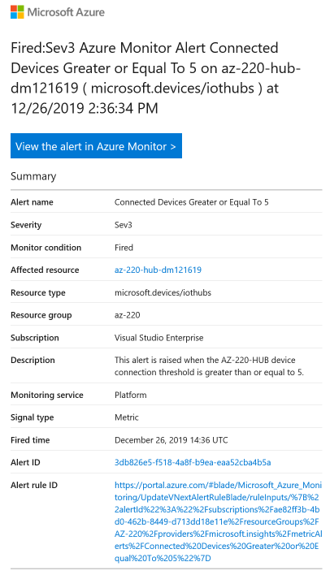

# Simulate Devices

In this task we will be generating X509 certificates from the root certifcate. We will then use these certificates in a console application that will simulate 10 devices connecting to DPS and sending telemetry to an IoT Hub.

## Generate Device Certificates

We will now generate and download 10 device certificates.

1. Open the **Azure Cloud Shell**, if it's not still open from earlier, and navigate to the `~/monitoring` directory.

1. To create an empty file in which we will copy the device generation script, enter the following commands:

    ```bash
    touch gen-dev-certs.sh
    chmod +x gen-dev-certs.sh
    ```

1. To edit the contents of the **gen-dev-certs.sh** file, use the **{ }** icon in Azure Cloud Shell to open the **Cloud Editor**.

    To open the **gen-dev-certs.sh** file, you will have to expand the **monitoring** node in the **Files** list to locate it.

1. Paste the following code into the cloud editor:

    ```bash
    #!/bin/bash

    # Generate 10 device certificates 
    # Rename for each device
    # download from the Cloud CLI
    pushd ~/certificates
    for i in {1..10}
    do
        chmod +w ./certs/new-device.cert.pem
        ./certGen.sh create_device_certificate asset-track$i
        sleep 5
        cp ./certs/new-device.cert.pfx ./certs/new-asset-track$i.cert.pfx 
        download ./certs/new-asset-track$i.cert.pfx 
    done
    popd
    ```

    This script will create and download 10 device certificates.

1. To save the edited **gen-dev-certs.sh** file, press **CTRL-Q**. If prompted to save you changes before closing the editor, click **Save**.

1. To run the **gen-dev-certs.sh** script, run the following:

    ```bash
    ./gen-dev-certs.sh
    ```

    While the script runs, you will see the output from the certificate generator and then the browser should automatically download each certificate in turn. Once it completes, you will have 10 certificates available in your browser download location:

    * new-asset-track1.cert.pfx
    * new-asset-track2.cert.pfx
    * new-asset-track3.cert.pfx
    * new-asset-track4.cert.pfx
    * new-asset-track5.cert.pfx
    * new-asset-track6.cert.pfx
    * new-asset-track7.cert.pfx
    * new-asset-track8.cert.pfx
    * new-asset-track9.cert.pfx
    * new-asset-track10.cert.pfx

With these certificates available, you are ready to configure the device simulator.

## Add Certificates to Simulator

1. Copy the downloaded **x.509 Device Certificate** files to the `/LabFiles` directory; within the root directory along-side the `Program.cs` file. The **Simulated Devices** project will need to access this certificate file when authenticating to the Device Provisioning Service.

    After copied, the certificate files will be located in the following locations:

    ```text
    /LabFiles/new-asset-track1.cert.pfx
    /LabFiles/new-asset-track2.cert.pfx
    /LabFiles/new-asset-track3.cert.pfx
    /LabFiles/new-asset-track4.cert.pfx
    /LabFiles/new-asset-track5.cert.pfx
    /LabFiles/new-asset-track6.cert.pfx
    /LabFiles/new-asset-track7.cert.pfx
    /LabFiles/new-asset-track8.cert.pfx
    /LabFiles/new-asset-track9.cert.pfx
    /LabFiles/new-asset-track10.cert.pfx
    ```

1. Using **Visual Studio Code**, open the `/LabFiles` folder.

1. Open the `Program.cs` file.

1. Locate the `GlobalDeviceEndpoint` variable, and notice it's value is set to `global.azure-devices-provisioning.net`. This is the **Global Device Endpoint** for the Azure Device Provisioning Service (DPS) within the Public Azure Cloud. All devices connecting to Azure DPS will be configured with this Global Device Endpoint DNS name.

    ```csharp
    private const string GlobalDeviceEndpoint = "global.azure-devices-provisioning.net";
    ```

1. Locate the `dpsIdScope` variable, and replace the value with the **ID Scope** of the Device Provisioning Service.

   ```csharp
   private static string dpsIdScope = "<DPS-ID-Scope>";
   ```

   We need to replace the `<DPS-ID-Scope>` value with the actual value.

1. Return to the Azure cloud shell and enter the following command:

    ```bash
    az iot dps show --name AZ-220-DPS-{YOUR-INITIALS-AND-CURRENT-DATE} --query properties.idScope
    ```

    > [!NOTE] Ensure you use the name of your DPS instance above.

    Copy the output of the command and replace the `<DPS-ID-Scope>` value in Visual Studio code. It should look similar to:

   ```csharp
   private static string dpsIdScope = "0ne000A6D9B";
   ```

This app is very similar to the app used in the earlier lab **L06-Automatic Enrollment of Devices in DPS**. The primary difference is that instead of just enrolling a single device simulator and then sending telemetry, it instead enrolls 10 devices, one every 30 seconds. Each simulated device will then send telemetry. This should then cause our alert to be raised and log monitoring data to storage.

## Run the Simulator

1. To run the app, in Visual Studio Code, open a terminal, and enter the following command:

    ```bash
    dotnet run
    ```

    You should see output that shows the first device being connected via DPS and then telemetry being sent. Every 30 seconds thereafter, and additional device will be connected and commence sending telemetry until all 10 devices are connected and sending telemetry.

1. Return to the DPS group enrollment in the Azure Portal.

1. In the **simulated-devices** enrollment group, to view the connected devices, click **Registration Records**.

    You should see a list of the devices that have connected. You can hit **Refresh** to update the list.

    Now that we have the devices connected and sending telemetry, we await the triggering of the alert once we have 5 or more devices connected for 5 mins. You should receive and SMS message that looks similar to:

    ```text
    AZ220EmailAG:Fired:Sev3 Azure Monitor Alert Connected Devices Greater or Equal to 5 on <your IoT Hub>
    ```

    The email will look similar to:

    


1. Once the alerts have arrived, you can exit the application by either hitting **CTRL+C** in the Visual Studio Code terminal, or by closing Visual Studio Code.

    > [!NOTE] When the devices are disconnected, you will receive messages informing you the alert has been resolved.

Now, let's check the storage account to see if anything has been logged by Azure Monitor.