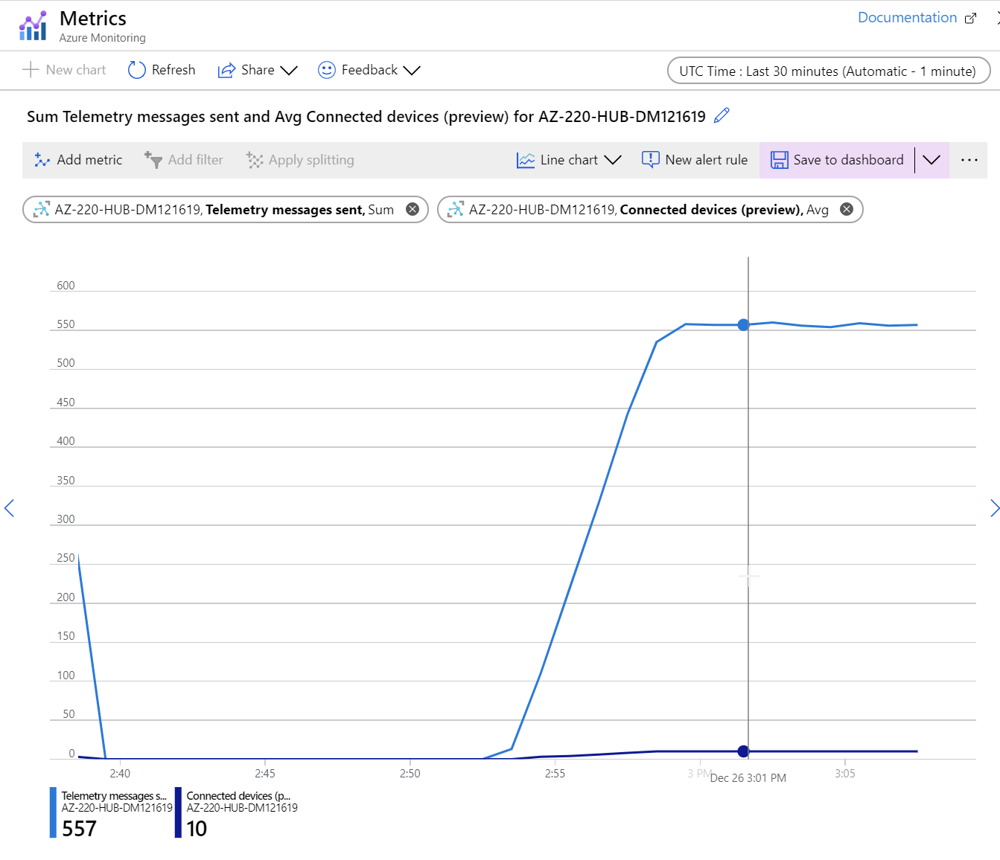

# Review Metrics, Alerts and Archive

## See the Metrics in the Portal

1. In the Azure Portal, open the Metrics chart you pinned to the dashboard by clicking on the chart title.

    The chart will open and fill the page.

1. Change the time values to the **Last 30 minutes**.

    Notice that you can see *Telemetry messages sent* and *Connected devices (preview)** values, with the most recent numbers at the bottom of the chart - move you mouse over the chart to see values a specific points in time.

    

## See the Alerts

To use the Azure Portal to review alerts, complete the following steps.

1. In the Azure Portal, in the search box at the top of the screen, enter **Monitor** and the select **Monitor** from the list, under **Service**.

    The **Monitor - Overview** page is displayed. This is the overview for all of the monitoring activities for the current subscription.

1. In the left hand navigation, select **Alerts**.

    This alerts view shows all alerts for all subscriptions. Let's filter this to the IoT Hub.

1. At the top of the page, under **Subscription**, select the subscription you are using.

1. Under **Resource group**, select "AZ-220-RG".

1. Under **Resource**, select **AZ-220-HUB-{YOUR-INITIALS-AND-CURRENT-DATE}**.

1. Under **Time range**, select **Past hour**.

    You should now see a summary of alerts for the last hour. Under **Total alert rules** you should see **1**, the alert you created earlier. Below this, you will see a list of the severity categories as well as the count of alerts per category. The alerts we are interested in are **Sev 3**. You should see at least one (if you have stopped and restarted the device simulator, you may have generated more that one alert).

1. In the list of severities, click **Sev 3**.

    the **All Alerts** page will open. At the top of the page you will see a number of filter fields - these have been populated with the values from the preceding screen so that only the **Sev 3** alerts for the selected IoT hub are shown. It will show you the alerts that are active, and if there are any warnings.

1. Select an alert from the list.

    A pane will open showing a **Summary** of the details for the alert. This includes a chart illustrating why the alert fired - a dash line shows the threshold value as well as the current values for the monitored metric. Below this are details of the **Criterion** and other details.

1. At the top of the pane, below the title, click **History**.

    In this view you can see when the alert fired, the action group that was invoked, and any other changes such as when the alert is resolved and so on.

1. At the top of the pane, below the title, click **Diagnostics**.

    If there were any issues related to the alert, addition details would be shown here.

## See the Diagnostic Logs

Earlier, you set up your diagnostic logs to be exported to blob storage. Let's check to see what was written.

1. Navigate to your "AZ-220-RG" resource group.

1. In the list of resources, select the Storage Account that was created earlier - **az220storage{YOUR-INITIALS-AND-CURRENT-DATE}**.

    The **Overview** for the storage account will be displayed.

1. Scroll down until you can see the metrics charts for the Storage Account: *Total egress*, *Toral ingress*, *Average latency* and *Request breakdown*. 

    You should see that there is activity displayed.

1. To view the data that has been logged, in the left hand navigation area, select **Storage explorer (preview)**.

1. In the **Storage explorer** pane, expand the **BLOB CONTAINERS** node.

    When Azure Monitor first sends data to a storage account, it creates a container called **insights-logs-connection**.

1. Select the **insights-logs-connection** container - the contents of the container will be listed to the right.

    Logs are written to the container in a very nested fashion. You will need to open each subfolder in turn to navigate to the actual log data. The structure is similar to that show below:

    * **resourceId=**
      * **SUBSCRIPTIONS**
        * **<GUID>** - this is the ID for the subscription that generated the log
          * **RESOURCEGROUPS** - contains a folder for each resource group that generated a log
            * "AZ-220-RG" - the resource group that contains the IoT Hub
              * **PROVIDERS**
                * **MICROSOFT.DEVICES**
                  * **IOTHUBS**
                    * **AZ-220-HUB-{YOUR-INITIALS-AND-CURRENT-DATE}** - contains a folder for each year where a log was generated
                      * **Y=2019** - contains a folder for each month where a log was generated
                        * **m=12** - contains a folder for each day where a log was generated
                          * **d=15** - contains a folder for each hour where a log was generated
                            * **h=15** - contains a folder for each minute where a log was generated
                              * **m=00** - contains the log file for that minute

    Drill down until you get to the current date and select the most recent file.

1. With the file selected, in the toolbar at the top of the pane, click **Download**.

1. Open the downloaded file in Visual Studio Code.

    You should see a number of lines of JSON.

1. To make the JSON easier to read, press **F1**, enter **Format document** and select **Format document** from the list of options.

    The JSON will show a list of connection and disconnection events similar to:

    ```json
    {
        "time": "2019-12-26T14:32:45Z",
        "resourceId": "/SUBSCRIPTIONS/AE82FF3B-4BD0-462B-8449-D713DD18E11E/RESOURCEGROUPS/AZ-220/PROVIDERS/MICROSOFT.DEVICES/IOTHUBS/AZ-220-HUB-DM121619",
        "operationName": "deviceConnect",
        "category": "Connections",
        "level": "Information",
        "properties": "{\"deviceId\":\"asset-track9\",\"protocol\":\"Amqp\",\"authType\":\"{\\\"scope\\\":\\\"device\\\",\\\"type\\\":\\\"x509Certificate\\\",\\\"issuer\\\":\\\"external\\\",\\\"acceptingIpFilterRule\\\":null}\",\"maskedIpAddress\":\"67.176.115.XXX\",\"statusCode\":null}",
        "location": "westus"
    }
    {
        "time": "2019-12-26T14:33:12Z",
        "resourceId": "/SUBSCRIPTIONS/AE82FF3B-4BD0-462B-8449-D713DD18E11E/RESOURCEGROUPS/AZ-220/PROVIDERS/MICROSOFT.DEVICES/IOTHUBS/AZ-220-HUB-DM121619",
        "operationName": "deviceConnect",
        "category": "Connections",
        "level": "Information",
        "properties": "{\"deviceId\":\"asset-track10\",\"protocol\":\"Amqp\",\"authType\":\"{\\\"scope\\\":\\\"device\\\",\\\"type\\\":\\\"x509Certificate\\\",\\\"issuer\\\":\\\"external\\\",\\\"acceptingIpFilterRule\\\":null}\",\"maskedIpAddress\":\"67.176.115.XXX\",\"statusCode\":null}",
        "location": "westus"
    }
    {
        "time": "2019-12-26T14:37:29Z",
        "resourceId": "/SUBSCRIPTIONS/AE82FF3B-4BD0-462B-8449-D713DD18E11E/RESOURCEGROUPS/AZ-220/PROVIDERS/MICROSOFT.DEVICES/IOTHUBS/AZ-220-HUB-DM121619",
        "operationName": "deviceDisconnect",
        "category": "Connections",
        "level": "Information",
        "properties": "{\"deviceId\":\"asset-track8\",\"protocol\":\"Amqp\",\"authType\":null,\"maskedIpAddress\":\"67.176.115.XXX\",\"statusCode\":null}",
        "location": "westus"
    }
    {
        "time": "2019-12-26T14:37:29Z",
        "resourceId": "/SUBSCRIPTIONS/AE82FF3B-4BD0-462B-8449-D713DD18E11E/RESOURCEGROUPS/AZ-220/PROVIDERS/MICROSOFT.DEVICES/IOTHUBS/AZ-220-HUB-DM121619",
        "operationName": "deviceDisconnect",
        "category": "Connections",
        "level": "Information",
        "properties": "{\"deviceId\":\"asset-track4\",\"protocol\":\"Amqp\",\"authType\":null,\"maskedIpAddress\":\"67.176.115.XXX\",\"statusCode\":null}",
        "location": "westus"
    }
    ```

    Notice that each individual entry is a single JSON record - the overall document is not a a valid JSON document. Within each record you can see details relating to the originating IoT Hub and **properties** for each event. Within the **properties** object, you can see the connecting (or disconnecting) **deviceId**.

## Wrap Up

In this lab you performed the following tasks:

* Using Azure CLI, created an IoT hub, Linked DPS instance, and a storage account.
* Enable diagnostic logs.
* Enable metrics.
* Set up alerts for those metrics.
* Download and run an app that simulates IoT devices connecting via X509 and sending messages to the hub.
* Run the app until the alerts begin to fire.
* View the metrics results and check the diagnostic logs.

Once you have completed this lab, you will wish to exit the device simulator app.
